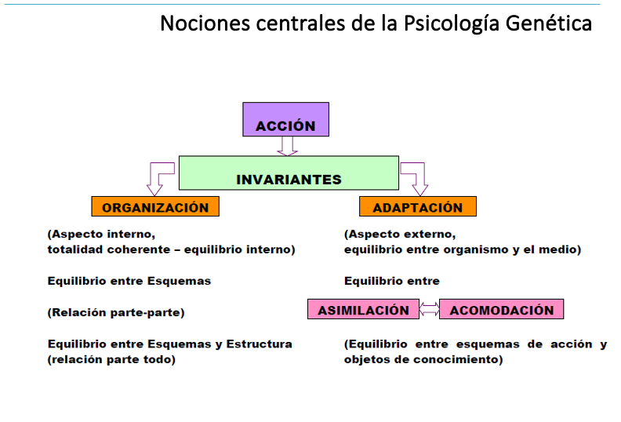

# #PEG #20252Q #filo   
#   
# ==Clase 1 08/07 - Ausente==  
  
  
**Preguntas iniciales y respuestas orientativas**  
  
1. **¿Por qué Psicología y Epistemología Genética?**  
- Porque **no se puede separar el estudio del desarrollo psicológico** de las condiciones de conocimiento que lo hacen posible.  
- La **Psicología del Desarrollo** describe *cómo* cambian las estructuras cognitivas.  
- La **Epistemología Genética (Piaget)** explica *por qué* y *de qué modo* surge conocimiento nuevo en ese proceso.  
  
2. **¿Qué estudia la Psicología del Desarrollo?**  
- El **cambio a lo largo del tiempo** en las funciones psicológicas.  
- El **proceso constructivo** de estructuras cognitivas, afectivas y sociales.  
- Cómo el sujeto se transforma en interacción con el **ambiente** (biológico, social, cultural).  
  
- Es **irreversible en términos estructurales**: una vez construida una estructura, no se pierde.  
- Pero **no es lineal ni uniforme**: pueden haber regresiones aparentes, desigualdades de ritmo y diferencias individuales.  
- Piaget lo explica con la idea de **equilibración**: siempre hay avances, desajustes, reequilibrios → pero en dirección constructiva.  
  
  
3. ** ¿Cómo se explica la “novedad cognoscitiva”?**  
- Como un **emergente**, no predeterminado, que surge de la interacción organismo–ambiente.  
- No es mera acumulación, sino **transformación estructural**.  
- Ejemplo en Piaget: los **estadios** (sensoriomotor, preoperacional, etc.) muestran nuevas formas de pensar que antes no existían.  
  
4. ** ¿Qué mecanismos dan cuenta de ella?**  
- **Piaget:** asimilación, acomodación y equilibración → permiten reorganizar estructuras cognitivas.  
- **Vigotsky:** mediación cultural y herramientas simbólicas (lenguaje).  
- **García y teorías de sistemas complejos:** emergencia de nuevas formas a partir de interacciones múltiples y no lineales.  
  
👉 Con esto se puede responder que el **desarrollo psicológico** se entiende como:  
- Un proceso **constructivo e histórico**.  
- Explicado por **mecanismos internos** (equilibración, reorganización) y **externos** (mediación social, contexto cultural).  
- Con un **marco relacional** (individuo-en-situación), más que uno escisionista (individuo aislado).  
  
#Genesis refiere a los procesos de transformación en el desarrollo, no a la ciencia biológica.  
  
La #psicologia del desarrollo pretende comprender y explicar los cambios en el tiempo. La #emergencia de novedades cognoscitivas a partir de sistemas o estructuras que no estaban presentes. #Aprendisaje  
  
#MEE Marco Epistémico Escisionista. El individuo y sus habilidades se estudian como unidades y factores independientes del contexto.  
  
#MER Marco Epistémico Relacional. Su ontología no consta de cosas, sino de relaciones. Un complejo entramado compuesto que abarca relaciones entre sujeto y objeto, naturaleza y cultura, individuo y sociedad, interno y externo, etc.  
  
La **Unidad de Análisis** es el individuo en un contexto didáctico.  
  

| Categoría | Innatismo (Psicometría) | Conductismo (Aprendizaje) | Constructivismo-Genético (Desarrollo) |
| ----------------------------------------- | ----------------------------------------------------- | -------------------------------------------- | --------------------------------------------------------------- |
| Relación Sujeto–Objeto | S → O (el sujeto ya tiene facultades dadas) | S ← O (el conocimiento viene del objeto) | S ↔ O (interacción activa mediante acción) |
| Mecanismos de producción del conocimiento | Facultades innatas (inteligencia) + herencia genética | Asociación estímulo–respuesta | Interacción a través de esquemas, asimilación y acomodación |
| Naturaleza del conocimiento | Estado: conocimiento = totalidad de lo conocido | Estado: suma de respuestas aprendidas | Proceso: construcción dinámica sujeto–medio |
| Origen y naturaleza del cambio | Interno: estructura dada, transformación estructural | Externo: variaciones del mundo se incorporan | Dialéctica entre lo interno y lo externo (estructura ↔ función) |
  
  
### ==Clase 2 08/15 - Constructivismo vs Empirismo vs Innatismo==  
  
#Piaget, Jean 1896 - 1980 #Suiza  
#Garcia, Rolando 1919 - 2012 #Argentina  
  
Pregunta Piagetiana: ¿Como se pasa de un estado de menor conocimiento a uno de mayor conocimiento?  
- Las epistemologías clásicas (#Racionalismo y #Empirismo) contiene supuestos psicológicos no corroborados. La E.G intenta explicar el conocimiento, en particular el Científico sobre la base de su historia (sociogénesis) y el origen de sus nociones psicológicas  
- La #EpistemologiaGenetica es el estudio de los estados sucesivos de una ciencia en función de su desarrollo.  
  
### Niveles de análisis  
1. **Análisis**   
2. **Desarrollo**   
3. **Aplicación** de la EG como instrumento de explicación de otras disciplinas.  
  
### Nivel 1: Análisis del material empírico provisto por la Historia de las Ciencias y la Psicología.  
* **Método** Histórico Crítico: Análisis histórico de las ideas científicas y sus métodos de producción. El modo en que producen conocimiento.  
* Psicología: Se ocupa de describir y explicar las regularidades en el surgimiento de normas que el sujeto utiliza hasta alcanzar el “razonamiento lógico”.  
  
### Nivel 2: Desarrollo de la teoría epistemológica en sentido estricto. La coherencias de sus postulados.  
* #ContinuidadFuncional (f. biológicas, psicológicas, historia de las ciencias y #DiscontinuidadEstructural   
* Interacción dialéctica: Relación S-O, ninguno preexiste al otro)  
* Constructivismo: No hay nada pre-formado.  
* Marco Social Epistémico  
  
#DiscontinuidadEstructural 🔹** ¿Qué significa?**  
- El desarrollo cognitivo no es **lineal ni acumulativo**, sino que se organiza en **estructuras cualitativamente distintas**.  
- Cada **etapa** (sensoriomotriz, preoperatoria, operatoria concreta, operatoria formal) tiene su **propia lógica interna** que no puede reducirse a la anterior.  
- Cuando el niño pasa de una etapa a otra, se produce una **transformación estructural** → un “salto” en la manera de organizar el conocimiento.  
  
Ejemplo:  
- Un niño en la etapa preoperatoria (2-6 años) **no puede todavía conservar cantidades** (cree que un vaso alto tiene más agua que uno bajo aunque tengan lo mismo).  
- En la etapa operatoria concreta (7-11 años), aparece la **estructura de operaciones lógicas** que le permite entender la conservación.  
👉 Ese pasaje no es simple “acumulación de aprendizajes”, sino una **reestructuración cualitativa** de su pensamiento.  
  
# ==Clase 3 08/21 - ==  
**Notas de Clase – Epistemología Genética (Piaget)**  
  
**Primera Hipótesis Epistemológica**  
Para explicar el surgimiento de cualquier función es necesario:  
1. **Recorrer su génesis** → el momento de construcción.  
2. **Analizar sus grados de formalización** → la estructura.  
  
**Segunda Hipótesis Epistemológica**  
**Supuesto**: Existe continuidad entre **filogénesis** (desarrollo histórico de la especie) y **ontogénesis** (desarrollo del individuo).  
**Métodos principales**:  
- **Métodos Genéticos**  
    - MHC → **Método Histórico-Crítico**  
    - MPC → **Método Psicogenético**  
- **Métodos Estructurales**  
    - **Análisis Formalizante**: sistematiza las estructuras lógico-matemáticas del pensamiento. **Análisis Directo**: introspección individual, típico de filósofos y pensadores. No es sistemático, aunque a veces se incluye en análisis lógicos.  
  
**Métodos de la Epistemología Genética**  
**1. Historia de las Ciencias → Método Histórico-Crítico**  
- Analiza cómo se fueron conformando las ideas científicas y sus métodos de producción.  
- Permite describir y analizar:  
- Formas de pensamiento adoptadas en la historia.  
- Productos de ese pensamiento (conocimiento válido en cada época según sus criterios de validación).  
  
**2. Psicogénesis → Método Psicogenético**  
- Reconstrucción empírica del desarrollo del pensamiento desde la infancia hasta la adultez.  
- Se interesa en cómo organiza el sujeto su experiencia.  
- Analiza el **pasaje de un conocimiento menor a uno mayor**.  
- Piaget desarrolló para esto un instrumento específico: **Método Clínico-Crítico**.  
  
  
**Método Clínico-Crítico**  
**Clínico**: adopta el formato de indagación de la psiquiatría → busca entender la lógica del pensamiento del sujeto.  
**Crítico**: las hipótesis del sujeto son permanentemente puestas a prueba.  
  
**Características:**  
- Indaga las lógicas que organizan el pensamiento infantil.  
- Permite comprender la construcción y transformación de las **estructuras operatorias**.  
- Surge como alternativa al **experimentalismo psicométrico** y a la **observación pura** de la psicología evolutiva.  
  
**Objetividad:**  
- No se entiende como “máxima distancia” (conductismo).  
- Se entiende como **máxima interacción** entre sujeto y objeto de conocimiento.  
- Implica una interacción activa entre investigador y niño.  
  
**Tres Momentos en las Investigaciones de Piaget**  
1. **Primer momento (1926)**  
- Exploración de las creencias infantiles.  
- Método: **diálogo verbal** con niños.  
2. **Segundo momento**  
- Indagación de las **organizaciones sensorio-motrices**.  
- Objeto: **grupo práctico de desplazamiento**.  
- Muestra que no son intuiciones sino construcciones progresivas.  
    - Método: **observación sistemática en situaciones experimentales** (no verbal).  
3. **Tercer momento**  
- Estudio de las **estructuras operatorias propiamente dichas**:  
- Invariantes conceptuales sobre cantidades físicas.  
- Invariantes geométricas.  
- Cantidades lógico-matemáticas.  
- Se investigan las transformaciones subyacentes en los argumentos de conservación.  
- Método: **modo mixto** → preguntas y respuestas + manipulación de objetos por el niño.  
  
### ==Clase 4 08/29 ==  
**Conceptos Centrales del Constructivismo Piagetiano**  
**Definiciones iniciales**  
- La **Epistemología Genética** sostiene que **Sujeto (S) y Objeto (O)** se constituyen mutuamente a través de la **Acción** (concepto clave).  
- La acción precede, acompaña y prolonga la constitución de S y O.  
- Supera la antinomia S–O, sustituyendo el concepto de **Asociación** por el de **Asimilación**.  
- Las **estructuras asimiladoras** no preexisten en el sujeto:  
- Se construyen en virtud de los requerimientos de la acción.  
- La acción es la interacción S–O, un movimiento de doble integración que complejiza el desarrollo.  
- **“La acción es constitutiva de todo conocimiento.”**  
- El conocimiento se construye en la interacción organismo–medio y, más adelante, esquemas–objetos.  
- La acción es una **función básica de todo organismo vivo**:  
    - Constituye esquemas y estructuras dinámicas.  
    - Permite adaptación en los niveles: biológico, psicológico e histórico-social.  
    - A través de la acción, las estructuras se superan, se complejizan y producen conocimiento.  
- **“El sujeto no conoce más propiedades del objeto que las que su acción le permite conocer.”**  
- El conocimiento surge de los **esquemas producidos por el sujeto** para apropiarse de la realidad.  
- La asimilación al principio deforma el objeto, pero con la repetición de esquemas deviene en un conocimiento más completo y complejo.  
- **Piaget (1986):**  
    - Al comienzo no existe ni sujeto epistémico, ni objetos concebidos, ni instrumentos invariantes de intercambio.  
    - El problema inicial del conocimiento es construir esos mediadores.  
    - Desde el contacto entre cuerpo y cosas, la construcción se dirige hacia lo exterior y lo interior, elaborando solidariamente sujeto y objeto.  
  
**Conocimiento como acción**  
- El conocimiento no procede de un sujeto ya constituido ni de objetos dados.  
- Surge de la interacción indiferenciada entre ambos.  
- El instrumento inicial de intercambio es la **acción en su conjunto**, no las percepciones (contra el conductismo).  
  
**Acción como significación**  
- El conocimiento es acción cuando la acción se dirige a las cosas.  
- Coincide con el axioma marxista: **“el conocimiento es praxis sobre el mundo.”**  
- **Castorina (2012, p.28)**: Para que una acción produzca conocimiento debe estar orientada a los objetos, darles significado y modificarse según alcance o no a los objetos.  
  
**De la acción a la operación**  
Dos momentos de la acción:  
1. **Acciones sensorio-motrices** → previas al lenguaje y a la representación.  
2. **Acciones interiorizadas** → mediadas por la función simbólica, que permiten traducir la acción en **pensamiento conceptualizado**.  
- Requieren una reestructuración de esquemas.  
- Se constituyen en **operaciones**.  
  
**Explicaciones genéticas**  
**1. Biogenesis**: La raíz biológica de las estructuras lógico-matemáticas no está ni en la acción exclusiva del medio, ni en innatismos, sino en la **autorregulación vital** → tendencia a la **equilibración**.  
**2. Biogénesis – Psicogénesis – Sociogénesis**  
- Plano biológico: acción en intercambios físico-químicos entre organismo y medio.  
- Planos psicológico y epistemológico: acción en la interacción S–O, en intercambios funcionales.  
- Esto permite afirmar:  
    - **Continuidad funcional** y **discontinuidad estructural** en la constitución del sujeto epistémico.  
    - Existen mecanismos de funcionamiento comunes en lo biológico, lo psicológico y en la historia de las ciencias.  
    - Hay una **herencia funcional** (capacidad potencial de desarrollo).  
- Y una **herencia estructural** (estructuras biológicas que se complejizan y prolongan en esquemas de conducta).  
  
**Invariantes funcionales**  
- Mecanismos de funcionamiento general → expresan al sujeto como **totalidad funcional**.  
- Dos invariantes principales: **Organización** y **Adaptación**.  
- La adaptación, a su vez, es equilibrio entre **Asimilación** y **Acomodación**.  
- Conceptos tomados de la biología, pero ampliados.  
  
  
**Organización y Adaptación **  
  
**Organización**  
- Aspecto interno de la construcción.  
- Consiste en la **coherencia interna del sistema**.  
- Tiende al equilibrio:  
- entre esquemas (entre si)  
- y entre esquemas y la estructura como totalidad.  
  
**Adaptación**  
- Aspecto externo.  
- Expresa el equilibrio entre **organismo–medio**, o en lo psicogenético, entre **esquemas de acción y objetos**.  
  
**Asimilación y Acomodación**  
  
**Asimilación**  
- Incorporación de objetos o eventos a esquemas o estructuras previas del sujeto.  
- Va desde reflejos primarios hasta el pensamiento científico.  
- Siempre implica atribuir significación según los esquemas.  
  
**Acomodación**  
- Acción complementaria a la asimilación.  
- Consiste en las **modificaciones necesarias en los esquemas** para poder asimilar un objeto.  
  
**Esquemas de acción**  
- Un **esquema** es un conjunto de acciones coordinadas según reglas.  
- Constituye un sistema de actos generalizables y transferibles.  
- Permite organizar los intercambios con el medio.  
   
**Concepto clave**  
- El esquema es un **constructo teórico** elaborado por el investigador.  
- Supone correlatos en actos observables.  
- Tipos de esquemas:  
    - **Primarios** → derivados de reflejos.  
    - **Secundarios** → coordinación de esquemas → principio de la lógica.  
  
**Tipos de esquemas**  
- **Esquemas prácticos** → organizan acciones materiales.  
- **Esquemas representativos** → interiorizados en representaciones.  
Cuando logran ser reversibles → se transforman en **esquemas operatorios** (operaciones).  
  
#Piaget, Jean 1896 - 1980 #Suiza  
  
  
  
==Clase 5 09/05==  
  
**Nociones centrales de la Psicología Genética (Piaget)**  
Es el punto de partida.  
A partir de la acción surgen las **invariantes funcionales**.  
  
**Invariantes funcionales**  
Son mecanismos constantes del desarrollo cognitivo. Se dividen en:  
  
**1. Organización (aspecto interno)**  
- Garantiza la coherencia interna del sistema → **equilibrio interno**.  
- Supone:  
- **Equilibrio entre esquemas** (relación parte–parte).  
- **Equilibrio entre esquemas y la estructura total** (relación parte–todo).  
  
**2. Adaptación (aspecto externo)**  
- Garantiza el **equilibrio entre organismo y medio**.  
- Se expresa como equilibrio entre:  
- **Asimilación** → incorporar objetos/eventos a los esquemas ya existentes.atribuir significados en función de los esquemas aplicados  
- **Acomodación** → modificar esquemas para poder asimilar nuevos objetos.  
- Resultado: **equilibrio entre esquemas de acción y objetos de conocimiento**.  
  
📌** En síntesis**  
**La acción** genera las **invariantes** que regulan el desarrollo cognitivo.  
Estas invariantes son **Organización** (coherencia interna) y **Adaptación** (ajuste al medio).  
La **Adaptación** funciona mediante el juego dinámico entre **Asimilación y Acomodación**.  
  
  
                ACCIÓN  
                   │  
            ───────┴────────  
                   │  
              INVARIANTES  
        (mecanismos constantes)  
                   │  
      ┌────────────┴────────────┐  
      │                         │  
 ORGANIZACIÓN               ADAPTACIÓN  
 (aspecto interno)         (aspecto externo)  
 │                         │  
 │                         │  
 │                         ├─────────────► Equilibrio entre  
 │                         │                Asimilación y  
 │                         │                Acomodación  
 │                         │  
 ▼                         │  
- Equilibrio entre         ▼  
  esquemas (parte–parte)   ASIMILACIÓN  
- Equilibrio entre         (incorporar objetos  
  esquemas y estructura     a esquemas previos)  
  total (parte–todo)         
                           ACOMODACIÓN  
                           (modificar esquemas  
                            para asimilar objetos)  
  
Resultado final:  
Equilibrio interno (Organización) +  
Equilibrio externo (Adaptación) →  
Construcción del conocimiento  
  
  
==Clase 5 09/11 - Estructuras y Estadios==  
  
### GÉNESIS, ESTRUCTURA, EQUILIBRACIÓN   
  
“La noción de *estructura *no se confunde, en efecto, con cualquier totalidad… Se trata de un sistema parcial, pero que, en tanto que sistema, presenta leyes de totalidad, distintas de las propiedades de los elementos” (Piaget, 1982 p.205).  
  
“...la *génesis* es un sistema de transformaciones que comportan una historia y conducen por tanto de un estado inicial A a un estado B, siendo B más estable que el estado inicial sin dejar por ello de constituir su prolongación” (Piaget, 1982 P. 207)  
  
**Conceptos fundamentales (Piaget – Psicología Genética)**  
**Estructura**  
- No es cualquier totalidad.  
- Es un **sistema parcial** que presenta **leyes de totalidad**.  
- Sus propiedades no se reducen a la suma de los elementos.  
**Génesis**  
- Es un **sistema de transformaciones**.  
- Supone una **historia**: conduce de un estado inicial **A** a un estado **B**.  
- El estado **B** es más estable que **A**, pero constituye su **prolongación** (no es algo completamente distinto).  
**Equilibración**  
- El proceso mediante el cual las estructuras tienden a un **estado de equilibrio** más estable.  
- Implica la **autorregulación** del sistema.  
- Es el mecanismo que explica cómo se pasa de la génesis a estructuras cada vez más complejas.  
  
**Tesis piagetianas (según el archivo)**  
1. La **estructura** tiene leyes propias y organiza los elementos en una totalidad.  
2. La **génesis** explica el desarrollo como transformación histórica entre estados sucesivos.  
3. La **equilibración** articula génesis y estructura:  
  
Permite comprender cómo surgen estructuras nuevas.  
Explica el paso de estados menos estables a estados más estables.  
  
👉 En síntesis:  
Piaget entiende el desarrollo cognitivo como un **proceso dialéctico entre génesis y estructura**, regulado por la **equilibración**. No basta describir estructuras estáticas: hay que ver **cómo se forman (génesis)** y cómo alcanzan **estabilidad relativa (equilibración)**.  
  
**Momentos del proceso de equilibración (según Piaget)**  
1. **Equilibrio (estado inicial)**  
- El sujeto se encuentra en un estado de relativa estabilidad con sus esquemas actuales.  
2. **Desequilibrio**  
- Surge un **conflicto cognitivo**.  
- Lo provoca la acción del sujeto sobre el medio cuando sus esquemas no alcanzan para dar cuenta de lo nuevo.  
3. **Regulación**  
- El sujeto intenta **resolver el conflicto** con los esquemas que ya conoce.  
- Si funciona, recupera el equilibrio.  
4. **Compensación**  
- Cuando los esquemas previos no alcanzan, el sujeto debe **apelar a nuevos esquemas** o a **combinaciones entre ellos**.  
5. **Re-equilibrio (estado final, más estable)**  
- Se alcanza un **nuevo equilibrio**, con estructuras más estables y complejas.  
- Es lo que Piaget llama **equilibración mayorante** o de **maximización**: el sujeto progresa hacia un nivel superior de organización.  
  
👉 En síntesis: el proceso va de un equilibrio inicial → al conflicto (desequilibrio) → intentos de resolución (regulación y compensación) → y finalmente a un **nuevo equilibrio más avanzado**.  
  
  
🧠** Estadio Sensoriomotor (0 a 2 años aprox.)**  
  
**Desde el nacimiento hasta la adquisición del lenguaje**  
  
“Mientras que al comienzo el recién nacido lo refiere todo a sí mismo, al final (…) se sitúa ya como un cuerpo entre los demás”  
— *Piaget, 1979: 19*  
  
🧩** Características generales**  
- **Inteligencia práctica previa al lenguaje**: ligada a la acción, no al pensamiento simbólico.  
- **Construcción de la realidad**:  
    - **Objeto**  
    - **Espacio**  
    - **Tiempo**  
    - **Causalidad**  
- Basada en **percepciones y movimientos** coordinados (coordinación sensoriomotriz).  
- La **inteligencia no es innata**: se forma a través de mecanismos sensoriomotores.  
- La **actividad organizadora del sujeto** es tan importante como los estímulos externos.  
  
📶** Subestadios del Estadio Sensoriomotor**  
  
**Subestadio I (0 a 1-2 meses): Reflejos**  
- Actividades espontáneas y reflejas.  
- Formación de **esquemas de asimilación**:  
    - Reproductora o funcional  
    - Generalizadora  
    - Recongnoscitiva  
  
**Subestadio II (1-2 a 4 meses): Primeros hábitos**  
- **Reacciones circulares primarias** (centradas en el propio cuerpo).  
- Aparecen los **hábitos elementales**: el niño repite acciones placenteras.  
- No hay distinción medios/fines desde el punto de vista del niño .  
  
**Subestadio III (4 a 8-9 meses): Coordinación de esquemas**  
- **Reacciones circulares secundarias** (sobre objetos).  
- Coordinación **visión-prensión**.  
- Primer **umbral de inteligencia**: comienza a distinguir medios y fines.  
- Búsqueda de objetos parcialmente ocultos.  
- **Diferenciación incipiente del yo-no yo**.  
  
**Subestadio IV (8-9 a 12 meses): Conductas intencionales**  
- Coordinación de **esquemas secundarios**.  
- **Acciones con finalidad previa**: uso intencional de medios conocidos.  
- Búsqueda de **objetos totalmente ocultos**.  
- Aparece la **reacción A no B**: el objeto es buscado donde se encontraba antes, no donde fue escondido.  
- **Inicio de las relaciones objetales**.  
- Se estructura **espacio y tiempo externos**.  
- Comienzan **satisfacciones psicológicas**.  
  
**Subestadio V (12 a 18 meses): Reacción circular terciaria**  
- Búsqueda de **nuevos medios** por diferenciación de esquemas previos.  
- Ejemplos:  
    - **Conducta del soporte**: tirar de una manta para alcanzar un objeto.  
    - **Conducta de la cinta**: tirar de una cinta atada a un objeto.  
- Búsqueda del objeto por sus **desplazamientos**.  
  
**Subestadio VI (18 a 24 meses): Representación**  
- **Invención mental de nuevos medios**.  
- **Comienzos de la representación**.  
- Aparece la **conducta del bastón** (uso de instrumento).  
- **Grupo práctico de desplazamiento**: reversibilidad en la acción.  
- **Permanencia del objeto** consolidada.  
- El universo se estructura **fuera del niño**: espacio, tiempo y causalidad.  
  
💞** Aspectos socio-afectivos**  
- De **egocentrismo total** a **progresiva descentración**.  
- De **adualismo** (no distinción entre yo y mundo) a **diferenciación yo–no yo**.  
- Lo **cognitivo** y lo **socio-afectivo** se desarrollan **de manera solidaria**.  
  
📚** Bibliografía**  
Piaget, J. (1969). *Psicología del niño*. Madrid, Morata. Cap. 1.  
Piaget, J. (1979). *Seis estudios de Psicología*. Barcelona, Seix Barral. Primera parte, pp. 9–30.  
  
  
==Clase 5 09/18 - Pre Operatorio==  
  
🧠** Estadio Preoperatorio (2 a 7 años aprox.)**  
  
**Segundo estadio del desarrollo cognitivo según Piaget**  
  
**Características centrales**  
* **Aparición del signo** (significante diferenciado del significado):  
    * Habilita el uso del **lenguaje**, que permite:  
        * Reconstruir acciones pasadas  
    * Anticipar acciones futuras  
    * Pensar sin actuar (acción interiorizada)  
* **Interiorización de la acción**:  
    * Ahora puede representarse mediante **imágenes mentales**  
    * Aparece el **pensamiento intuitivo**  
    * Base para el desarrollo del pensamiento simbólico  
  
🧩** Función Semiótica o Simbólica** Capacidad para representar objetos o acciones sin que estén presentes físicamente.  
  
* **Símbolos (motivados, individuales)**  
    * Imitación diferida  
    * Juego simbólico  
    * Imagen gráfica  
    * Imagen mental  
  
* **Signos (arbitrarios, convencionales y colectivos)**  
    * Ejemplo: el lenguaje  
  
**Cinco conductas simbólicas fundamentales**  
1. **Imitación diferida**: Reproduce acciones después de haberlas visto  
2. **Juego simbólico**: Representa hechos reales modificándolos subjetivamente  
3. **Dibujo o imagen gráfica**: Evolución del dibujo:  
- **Garabato sin control**: no hay intención realista  
- **Garabateo controlado**: aparece trazado más controlado (ej. “renacuajo”)  
- **Realismo frustrado**: intención realista, pero con omisiones o superposiciones  
- **Realismo intelectual**: dibuja lo que sabe (no lo que ve)  
- **Realismo visual**: intenta reproducir perspectiva y proporciones visuales  
4. **Imagen mental**: Objeto interiorizado (no necesita estar presente)  
5. **Lenguaje**  
- Herramienta adaptativa fundamental  
- Se aprende por transmisión social  
- Paso de lo gestual a lo verbal  
  
**Tipo de pensamiento en el período preoperatorio**  
- **Pre-conceptual**: ideas generales pero no del todo formadas  
- **Intuitivo**: basado en la percepción inmediata más que en razonamientos lógicos  
- **Transductivo**: razona de caso a caso sin generalizar ni usar principios  
- **No reversible**: no puede invertir mentalmente una secuencia de acciones  
  
**Rasgos del pensamiento infantil en este estadio**  
- **Egocentrismo**: dificultad para adoptar el punto de vista del otro  
- **Animismo**: atribuye vida o intención a objetos inanimados  
- **Finalismo**: cree que todo tiene un propósito  
- **Artificialismo**: cree que todo fue creado por el ser humano  
  
💞** Área socio-afectiva**  
- Desarrollo de **sentimientos interindividuales** (por la socialización)  
- Aparición de **sentimientos morales intuitivos**  
- Regulación de intereses y valores mediante el pensamiento intuitivo  
  
  
  
==Clase 10/02 Operatorio Concreto==  
  
**Resumen del Estadio Operatorio Concreto**  
  
**El estadio de las operaciones concretas**  
En la teoría piagetiana, el estadio de las operaciones concretas se ubica aproximadamente entre los 7 y 11 años. Durante este período, el niño ==logra realizar operaciones mentales lógicas, pero siempre sobre objetos o situaciones concretas==. Es decir, no trabaja aún con lo abstracto ni lo hipotético, sino con lo que puede manipular, observar o comprobar directamente.  
  
**Pensamiento operatorio y relaciones cooperativas**  
El pensamiento se organiza en **estructuras operatorias**, que le permiten al niño aplicar reglas lógicas y coordinar acciones mentales de manera reversible. Estas operaciones están ligadas al mundo físico, pero se distinguen de las acciones motoras simples porque ya son **internas y simbólicas**. A su vez, este estadio está marcado por el desarrollo de relaciones cooperativas: el niño comienza a salir de su egocentrismo y a coordinar su perspectiva con la de los demás, lo que le permite comprender reglas compartidas y trabajar en grupo.  
  
**Los estadios del desarrollo**  
Piaget distingue cuatro grandes estadios:  
1. Sensoriomotor (0-2 años)  
2. Preoperatorio (2-7 años)  
3. Operatorio concreto (7-11 años)  
4. Operatorio formal (11 años en adelante)  
  
El estadio operatorio concreto, entonces, es un punto de inflexión: el niño supera las limitaciones del pensamiento preoperatorio, pero todavía no accede a la abstracción plena del formal.  
  
**El pasaje a las operaciones concretas**  
El niño deja atrás el pensamiento centrado en un solo aspecto de la realidad (característico del preoperatorio) y empieza a **==descentrarse==**, es decir, a considerar varias dimensiones de un problema al mismo tiempo. Puede coordinar relaciones, aplicar la **==reversibilidad==** (saber que una acción mental puede deshacerse) y manejar reglas lógicas aplicadas a contextos concretos.  
  
**Construcciones en el estadio operatorio concreto**  
Entre los logros más importantes se encuentran:  
- **Conservación**: comprensión de que ciertas propiedades permanecen estables aunque cambie la apariencia.  
- **Clasificación**: capacidad de organizar elementos en categorías jerárquicas.  
- **Seriación**: ordenar elementos en función de criterios cuantificables (tamaño, peso, longitud).  
- **Relaciones de orden**: establecer relaciones transitivas (si A > B y B > C, entonces A > C).  
  
Estas construcciones consolidan el paso de un pensamiento rígido y egocéntrico a uno más lógico y estructurado.  
  
**Otros rasgos del operatorio concreto**  
- El pensamiento del niño se vuelve más **flexible** y menos dependiente de la percepción inmediata.  
- Sin embargo, sigue estando **limitado a lo concreto**: necesita ejemplos visibles, tangibles o manipulables.  
- Surge la capacidad de razonar en términos de **conservación, clasificación y seriación**, pero todavía no maneja bien hipótesis abstractas o proposiciones puramente verbales.  
  
**Nociones de conservación**  
La conservación es uno de los indicadores clave del estadio operatorio concreto. El niño entiende que la cantidad, el volumen, la masa o el número permanecen iguales aunque cambie su forma o disposición.  
  
**Experiencia: Trasvasamiento de líquidos**  
En el experimento clásico, dos vasos idénticos contienen la misma cantidad de agua. Si se vierte el contenido de uno en un vaso más alto y estrecho, el niño preoperatorio cree que ahora hay más o menos agua. En cambio, el niño en el estadio operatorio concreto comprende que la **cantidad no varió**.  
  
**Pruebas sobre la conservación de sustancia**  
Otro ejemplo es el de la plastilina: si una bolita se aplasta y se convierte en un “chorizo”, el niño operatorio entiende que la cantidad de materia es la misma, aunque haya cambiado de forma.  
  
**Clasificación**  
El niño desarrolla la capacidad de agrupar objetos según propiedades comunes y, más aún, de comprender que una clase puede estar incluida dentro de otra. Por ejemplo: entender que “rosas” es una subclase dentro de “flores”. Este tipo de inclusión jerárquica supera la limitación del preoperatorio, que no logra coordinar simultáneamente el todo y la parte.  
  
**Progresos del preoperatorio al operatorio concreto**  
- El pensamiento deja de ser **centrado** en un solo aspecto.  
- Surge la **reversibilidad**: comprender que las acciones pueden revertirse mentalmente.  
- Se adquiere la **conservación** en sus distintas variantes (cantidad, volumen, peso).  
- Mejora la capacidad para **coordinar perspectivas** y razonar de manera lógica.  
  
**La seriación**  
Implica ordenar objetos en función de una dimensión: por ejemplo, alinear palitos de más corto a más largo. El niño operatorio concreto puede manejar estas secuencias lógicas y comprender la noción de orden creciente o decreciente.  
  
**Relaciones de orden**  
Además de la seriación, el niño puede establecer relaciones transitivas: si Juan es más alto que Pedro y Pedro más alto que Luis, entonces Juan es más alto que Luis. Este tipo de razonamiento requiere coordinación de relaciones y ya no depende solo de lo perceptivo.  
  
**Logros y nociones**  
El conjunto de logros del estadio incluye:  
- Conservación  
- Clasificación  
- Seriación  
- Reversibilidad  
- Relaciones de orden  
- Coordinación de puntos de vista  
  
Estas conquistas cognitivas permiten al niño resolver problemas de manera más lógica y consistente.  
  
**Tiempo y velocidad**  
En este estadio, los niños también comienzan a manejar nociones más complejas relacionadas con el tiempo, la distancia y la velocidad. Pueden entender, por ejemplo, que un objeto que recorre una mayor distancia en el mismo tiempo lo hace más rápido, y que estas variables se relacionan entre sí  
  
  
  
==Clase 10/16 Operatorio Formal==  
  
🧠** 1. Estadio de las operaciones formales**  
Corresponde aproximadamente a los **11-15 años**.  
Es la etapa final del desarrollo cognitivo según **Jean Piaget**.  
El pensamiento se vuelve **lógico, abstracto y sistemático**.  
  
📚** 2. Periodos del desarrollo según Piaget**  
**Sensorio-motor (0-2 años)**  
**Preoperatorio (2-7 años)**  
**Operaciones concretas (7-11 años)**  
**Operaciones formales (11-15 años)**  
→ En este último, aparece la capacidad de razonar sobre **hipótesis** y **posibilidades**.  
  
💡** 3. Características del pensamiento formal (Inhelder-Piaget)**  
Capacidad de **pensar sobre lo posible** y no solo sobre lo real.  
**Razonamiento hipotético-deductivo**.  
**Sistematización** del pensamiento (combinar, comparar, controlar variables).  
Uso de **lógica proposicional**.  
  
⚙️** 4. Las estructuras operatorias**  
Son **estructuras mentales reversibles**.  
Permiten operar con proposiciones abstractas y no solo con objetos.  
Se organizan en **sistemas de relaciones**.  
  
🔍** 5. Pensamiento hipotético-deductivo**  
Posibilidad de plantear **hipótesis** y deducir consecuencias lógicas.  
El adolescente puede elaborar **teorías** y **probarlas mentalmente**.  
  
🧩** 6. Rasgos del pensamiento hipotético-deductivo**  
**Diferenciación entre lo real y lo posible.**  
Capacidad de **formular y verificar hipótesis.**  
**Razonamiento combinatorio.**  
**Control de variables.**  
  
🧮** 7. Esquemas operatorios formales**  
Permiten combinar mentalmente todos los elementos posibles de una situación.  
Base del **razonamiento científico**.  
Ejemplo: analizar todas las combinaciones posibles de variables que producen un fenómeno.  
  
⚖️** 8. Inducción de leyes y disociación de factores**  
Capacidad de **separar factores** y ver cómo influyen independientemente.  
Permite **descubrir relaciones causales** y leyes generales.  
  
🔁** 9. Invariante estructural y reversibilidad**  
Las operaciones formales conservan la **estructura lógica**.  
Se pueden realizar **transformaciones reversibles** (si A → B, entonces puede pensarse B → A).  
  
🌐** 10. Lo posible sobre lo real**  
El pensamiento no se limita a lo existente.  
El adolescente imagina alternativas y realidades hipotéticas.  
“Lo posible se convierte en marco de referencia de lo real.”  
  
🧠** 11. Lógica proposicional**  
Se pasa de la lógica de clases y relaciones (concreta) a la **lógica proposicional** (abstracta).  
Se manipulan proposiciones: *si p entonces q*, *no p y q*, etc.  
  
🔢** 12. Combinatoria**  
Capacidad de generar todas las **combinaciones posibles** entre elementos.  
Ejemplo: de 4 elementos pueden obtenerse **16 combinaciones binarias**.  
Base para el razonamiento matemático y científico.  
  
🔄** 13. Grupo de las cuatro transformaciones (INRC)**  
Representa la **estructura lógica del pensamiento formal**:  
**I:** Identidad  
**N:** Negación  
**R:** Recíproca  
**C:** Correlativa  
El adolescente puede manipular mentalmente estas transformaciones.  
Ejemplo de razonamiento con “si p entonces q”, “si q entonces p”, “no p y q”, etc.  
  
🧩** 14. Combinatoria de las 16 operaciones binarias**  
Aplicación del pensamiento formal a la **lógica binaria**.  
Representa la capacidad de analizar **todas las combinaciones posibles de verdad o falsedad** de proposiciones.  
  
  
### ==Los sistemas de escritura en el desarrollo del niño==  
  
**Los sistemas de escritura en el desarrollo del niño**  
**Autoras:** Emilia Ferreiro y Ana Teberosky  
  
🎯** 2. Enfoque general**  
Las autoras sostienen que:  
El aprendizaje de la lectoescritura **no** debe reducirse a ejercicios perceptivo–motrices (copiar, repetir, trazar).  
Es el resultado de **conflictos cognitivos** que surgen de la interacción del niño con el **objeto de conocimiento**, en este caso, la **lengua escrita**.  
El niño construye activamente su conocimiento sobre qué es escribir y leer.  
  
👶** 3. Primeras observaciones (alrededor de los 4 años)**  
Los niños comienzan a **preguntar por los textos**: “¿Eso qué es?”  
Intentan **diferenciar dibujo y escritura**, imagen y texto.  
Comprenden que lo que “se puede leer” tiene características distintas de un dibujo.  
  
📗** 4. Primer período**  
  
> “Que un niño no sepa leer no impide que tenga ideas precisas sobre qué puede leerse.”  
  
Los niños elaboran **criterios propios** para decidir si algo “se puede leer”:  
**Criterio de cantidad:** el texto debe tener cierta cantidad mínima de letras o trazos.  
**Criterio de variedad:** debe haber **diversidad de signos**; no puede repetirse una misma letra muchas veces.  
  
🧩** 5. Segundo período**  
Se consolidan los **criterios de cantidad y variedad**.  
El niño distingue entre diferentes tipos de escrituras y empieza a reconocer que las letras **no son dibujos**.  
Aparecen los **grafemas no icónicos**, símbolos que el niño usa como si fueran letras, aunque no correspondan exactamente al alfabeto.  
  
💬** 6. Lo que “se puede leer” y lo que “no se puede leer”**  
El niño empieza a reconocer las **características gráficas** que hacen que un texto parezca “legible”.  
Comienza a establecer una relación entre la **forma escrita** y el **lenguaje oral**.  
  
🧠** 7. Transición hacia la fonetización de la escritura**  
El niño observa que las palabras escritas tienen **partes diferenciadas**.  
Se pregunta cómo esas partes se **corresponden con la palabra hablada**.  
Su primera respuesta: dividir en **sílabas**.  
➡️ Esto da origen a la **etapa silábica**.  
  
🔡** 8. Tercer período: Etapa silábica**  
Cada letra representa una **sílabas completa**.  
Se establece una **correspondencia entre partes del texto y partes del habla**.  
Por primera vez, el niño comprende que la escritura **representa sonidos**.  
  
🧩** 9. Etapa silábico-alfabética**  
Surge un **conflicto cognitivo**:  
La hipótesis silábica no basta para representar todas las palabras.  
El niño empieza a notar que necesita **más letras** para escribir.  
Aparecen preguntas como:  
“¿Cuál es la ‘to’?” → busca sílabas.  
Luego: “¿Cuál es la ‘t’?” → busca sonidos aislados.  
El niño empieza a **analizar los sonidos** de las palabras con mayor precisión.  
  
🔠** 10. Etapa alfabética**  
El niño comprende que cada **grafema (letra)** representa un **fonema (sonido mínimo)**.  
Realiza un **análisis fonético completo** de las palabras.  
A partir de aquí, enfrenta las **dificultades propias de la ortografía** (normas y excepciones).  
  
📚** 11. Ejemplos y recursos**  
  
Videos recomendados (YouTube):  
[https://youtu.be/8yc7ACAmPEQ](https://youtu.be/8yc7ACAmPEQ)  
[https://youtu.be/wElWPxIZaOE](https://youtu.be/wElWPxIZaOE)  
[https://youtu.be/ZjesNRLEETw](https://youtu.be/ZjesNRLEETw)  
[https://youtu.be/vSKvfhso-io](https://youtu.be/vSKvfhso-io)  
  
📖** 12. Bibliografía**  
**Ferreiro, Emilia & Teberosky, Ana** (1979). *Los sistemas de escritura en el desarrollo del niño.* México: Siglo XXI.  
**Ferreiro, Emilia** (2006). *La escritura antes de la letra.* *CPU-e, Revista de Investigación Educativa*, núm. 3, julio-diciembre, Instituto de Investigaciones en Educación, Veracruz, México.  
  
#Ferreiro, Emilia 1937-2023 #Argentina  
#Teberosky, Ana 1944 - #Argentina  
  
pizarrón:  
  
🧩** 1º Momento**  
*(No se distingue claramente el texto que sigue a “Momento”, parece un ejemplo de escritura infantil).*  
  
🧩** 2º Momento pre-silábica**  
**EL4U**  
**AINT**  
Hip. cantidad / variedad  
**Etapa pre-silábica**  
  
🧩** 3º Momento: Fonetización**  
1º Etapa → **Silábica**  
2º Etapa → **Silábico-alfabético**  
3º Etapa → **Alfabética**  
  
📘 **Interpretación general:**  
El pizarrón resume los **momentos del desarrollo de la escritura según Emilia Ferreiro y Ana Teberosky**:  
**1º momento:** primeras escrituras sin correspondencia con el sonido (garabatos o pseudoletras).  
**2º momento:** etapa **presilábica**, donde el niño aplica criterios de **cantidad y variedad** (cree que ciertas combinaciones de letras “se pueden leer”).  
**3º momento:** proceso de **fonetización de la escritura**, dividido en tres etapas:  
	1.	**Silábica** (una letra por sílaba).  
	2.	**Silábico-alfabética** (mezcla de sílabas y letras).  
	3.	**Alfabética** (correspondencia entre letra y sonido).  
  
## ==Clase 10/23 Vigotsky==  
  
**Vigotsky y la Teoría Socio-Histórica**  
  
**El paradigma de la acción mediada**  
  
**Planteos centrales de la teoría socio-histórica vigotskyana**  
**Autor:** Lev S. Vigotsky (Лев Семёнович Выготский, pronunciado *Liév Semiónovich Vigotski*)  
  
La teoría socio-histórica elaborada por Vigotsky parte de una idea fundamental: los **procesos psicológicos superiores (PPS)** —es decir, las funciones mentales que caracterizan la conducta humana consciente y voluntaria— **tienen un origen histórico y social**. No son innatos ni puramente biológicos, sino que **se forman a lo largo de la vida en interacción con los otros**, mediante la participación en prácticas culturales.  
  
Vigotsky distingue **dos grandes líneas del desarrollo psicológico**:  
1. **Procesos de la línea natural del desarrollo**  
- Son aquellos que el ser humano comparte con los mamíferos superiores.  
- Corresponden a las funciones biológicas básicas, tales como la **atención involuntaria, la memoria recognoscitiva y la percepción inmediata**.  
- Estas funciones operan de modo espontáneo y no requieren mediación simbólica.  
  
2. **Procesos de la línea cultural del desarrollo**  
- Son **específicamente humanos**, pues surgen en el marco de la vida social y cultural.  
- Se constituyen gracias a la **interiorización de herramientas y signos** que la cultura proporciona, como el **lenguaje, los sistemas numéricos o la escritura**.  
- Su rasgo distintivo es el **control voluntario de la conducta**, es decir, la capacidad de regular la acción propia a través de medios simbólicos.  
- En este sentido, el lenguaje funciona como el instrumento mediador por excelencia, ya que permite transformar la actividad externa en procesos internos de pensamiento.  
  
**Procesos Psicológicos Superiores (PPS)**  
Vigotsky distingue dentro de los PPS dos niveles de complejidad:  
- **PPS rudimentarios:** aparecen en los primeros momentos del desarrollo y constituyen la base sobre la cual se construyen las formas más elaboradas de actividad mental.  
- **PPS avanzados o específicos:** se desarrollan plenamente mediante la educación, la interacción social y la apropiación de herramientas culturales.  
  
En contraste con estos, los **procesos psicológicos elementales** (de origen biológico o natural) se transforman y reorganizan gracias a la mediación social, dando lugar a la mente propiamente humana.  
  
  
En síntesis, la teoría socio-histórica de Vigotsky propone que **la mente humana no puede entenderse fuera del contexto social y cultural en el que se desarrolla**. El sujeto no nace con las funciones psicológicas superiores ya formadas, sino que las **construye a través de la interacción con otros y con los instrumentos culturales**, proceso que se conoce como **internalización**.  
  
**Ideas centrales:**  
* El aprendizaje impulsa el desarrollo.  
* El juego es un espacio privilegiado para el desarrollo de funciones superiores.  
* A través del juego y la interacción con otros, el niño internaliza herramientas culturales y signos.  
  
## ==Clase 10/30 Desarrollo del conocimiento sobre la sociedad==  
  
🧠** El desarrollo del conocimiento sobre la sociedad**  
  
**1. Perspectiva general**  
El **conocimiento social** es el conjunto de ideas y explicaciones que las personas elaboran sobre el mundo social, las normas, instituciones y relaciones entre individuos. Desde una **perspectiva constructivista**, se entiende que este conocimiento **no es innato ni simplemente transmitido**, sino que **se construye activamente** en la interacción con los otros y con los contextos socioculturales.  
  
Comprender el mundo social exige una mirada **compleja y multidimensional**, ya que intervienen factores **cognitivos, morales, culturales e institucionales**. Por eso, el estudio del conocimiento social implica analizar **cómo los sujetos elaboran teorías implícitas o representaciones** acerca de los fenómenos sociales a partir de su experiencia cotidiana.  
  
**2. La especificidad del conocimiento social**  
A diferencia del conocimiento físico o natural, el conocimiento sobre la sociedad presenta **una complejidad particular**: su objeto no es externo ni natural, sino que está **constituido por prácticas humanas, normas, valores y significados compartidos**.  
Esto plantea un desafío al desarrollo cognitivo: el sujeto debe **conceptualizar fenómenos sociales** que no se perciben directamente, sino que deben **inferirse, interpretarse y reconstruirse** a partir de la experiencia y la comunicación social.  
  
**3. Dominios del conocimiento social (según Turiel y desarrollos posteriores)**  
En la investigación sobre la construcción de ideas sociales se distinguen **tres grandes dominios**:  
1. **Psicológico:** se refiere a la comprensión de las relaciones interpersonales, la individualidad, la autonomía y la “teoría de la mente”, es decir, la capacidad de atribuir intenciones o creencias a otros.  
2. **Moral:** abarca las concepciones sobre la justicia, los derechos, la equidad y el modo en que las personas deben tratarse entre sí.  
3. **Social-institucional:** incluye las representaciones acerca de **las instituciones, las normas sociales, las leyes, la autoridad o la organización política y económica**.  
  
Cada dominio tiene una dinámica particular, pero todos se interrelacionan en la experiencia social del sujeto.  
  
**4. Dificultades y restricciones en la construcción del conocimiento social**  
  
Castorina y colaboradores (2009) señalan que el desarrollo del conocimiento social está condicionado por una serie de **restricciones cognitivas y contextuales**.  
En el plano **cognitivo**, los niños parten de **teorías iniciales** o concepciones intuitivas sobre los fenómenos sociales, que progresivamente van reorganizando.  
En el plano **social y cultural**, los significados se construyen en diálogo con **las prácticas, las instituciones y las representaciones colectivas** de la comunidad.  
  
El conocimiento social, por tanto, **no se desarrolla de manera lineal ni universal**, sino en función de las **interacciones sociales concretas** y de los **modelos culturales** disponibles.  
  
**5. Elementos que intervienen en la construcción del conocimiento social**  
  
Los estudios en este campo coinciden en que intervienen al menos cuatro factores fundamentales:  
1. La **participación cotidiana** en prácticas sociales desde la infancia.  
2. El **contexto sociocultural específico**, con instituciones, sistemas normativos y estructuras simbólicas.  
3. Los **roles y normas sociales** que el individuo aprende y desempeña en diferentes instituciones (familia, escuela, comunidad).  
4. Las **ideologías y valores compartidos** que orientan la interpretación del mundo social.  
  
Estos factores interactúan entre sí, configurando las bases sobre las cuales los sujetos elaboran sus explicaciones acerca de la sociedad.  
  
**6. Supuestos teóricos y paradigmas**  
  
El análisis del conocimiento social se enmarca en debates más amplios sobre los **supuestos filosóficos** de la psicología del desarrollo.  
Las perspectivas **escisionistas** tienden a separar al sujeto del objeto de conocimiento.  
Las **relacionales o dialécticas**, en cambio, sostienen que ambos se constituyen mutuamente en la interacción.  
  
La propuesta constructivista —que orienta los trabajos de Castorina y su equipo— se inscribe en este segundo enfoque: el conocimiento se concibe como **una construcción activa e históricamente situada**, que integra dimensiones cognitivas y sociales.  
  
**7. El carácter social de la realidad**  
  
Siguiendo a **Berger y Luckmann (1968)**, se entiende que la **realidad social es una producción humana**, no un dato natural. Las instituciones, normas y valores se crean y se sostienen en la práctica social cotidiana, y **trascienden a los individuos particulares**.  
Esto implica que el conocimiento social requiere comprender **procesos de institucionalización, legitimación y transmisión cultural**, además de las operaciones cognitivas individuales.  
  
  
**8. Enfoques psicológicos sobre el conocimiento social**  
* **Psicología Social (Moscovici, 1961):** aporta la noción de **==representaciones sociales==**, entendidas como los sistemas de significados que los grupos construyen para interpretar la realidad y orientar la acción.  
* **Psicología Genética (Piaget, Castorina):** analiza cómo los niños **elaboran teorías sobre lo social** a partir de la interacción con su entorno.  
  
Las investigaciones actuales —como las de Castorina et al. (2009)— buscan **integrar ambas perspectivas**, mostrando que el conocimiento social se construye en el cruce entre los procesos individuales de pensamiento y las **representaciones colectivas** que circulan en la cultura.  
  
📚** Referencia**  
Castorina, J. A., Barreiro, A., Horn, A., Carreño, L., Lombardo, E., & Karabelnicoff, D. (2009). *Las restricciones en la construcción de ideas sociales. Revisión de un concepto.* Revista Irice, (20), 79–88.  
  
## ==Clase 11/06 Concepto de Restricción==  
  
restricciones lógicas o epistemologicas  
   
Tipos  
- Cognitivos  
- Sociales  
- Comunicacionales  
- Inter subjetivas  
  
Ideas Sociales  
  
Revision Teórica: 3 niveles  
- epistemologico genético  
- sociocultural:   
- comunicativo intersubjetivo   
  
  
