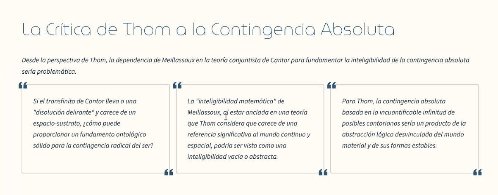

# #Thom, René Fréderic 1923 - 2002 #Francia   
#matematica #biologia #sistemasdinamicos #filo  
#matematica #biologia #sistemasdinamicos #filo  
#matematica #biologia #sistemasdinamicos #filo  
  
*Stabilité structurelle et morphogenèse* (1972) (*Estabilidad estructural y morfogénesis*).  
  
**Teoría de las catástrofes**  
- Desarrolla un marco matemático para describir cómo un sistema continuo puede producir cambios bruscos y cualitativos (catástrofes).  
- Explica transiciones súbitas en biología, física y fenómenos sociales.  
  
**Prioridad del continuo sobre lo discreto**  
- Para Thom, lo real es continuo: la naturaleza se organiza en campos de variación, no en entidades aisladas.  
- Lo discreto (objetos, individuos, estructuras estables) es el resultado de cortes o diferenciaciones en ese fondo continuo.  
- Esta postura lo opone a visiones atomistas o mecanicistas que ven la realidad como compuesta de unidades discretas.  
  
**Ausencia de espacialidad en lo fundamental**  
- Thom sostiene que en los niveles más básicos de la realidad (especialmente en procesos biológicos y formativos) no tiene sentido hablar de espacio como algo dado de antemano.  
- El espacio surge de la continuidad de los procesos y de la organización morfogenética.  
- Esto conecta con su idea de que el “ser” fundamental no es un conjunto de puntos en el espacio, sino un campo de transformaciones.  
  
**Aplicación filosófica**  
- En filosofía de la biología, Thom defiende que las formas vivientes no se entienden desde elementos discretos (genes, moléculas aisladas), sino desde continuidades dinámicas que se estructuran.  
- Su enfoque es una alternativa a la visión reduccionista.  

#local En el marco de René Thom y la teoría de sistemas dinámicos / catástrofes, cuando se habla de **fenómenos “locales”** se suele referir a lo siguiente:  
  
**Definición básica**  
Un **fenómeno local** es aquel que se manifiesta en una región limitada del espacio-tiempo o dentro de un sistema concreto, y cuya explicación puede darse considerando las **condiciones inmediatas** (las “vecindades” del sistema) sin necesidad de abarcar toda la totalidad del continuo.  
  
**En la teoría de Thom**  
- Los fenómenos naturales (biológicos, físicos, sociales) emergen sobre un **continuo global** de procesos.  
- Sin embargo, las **catástrofes** (los cambios bruscos de forma o estado) son **locales**: ocurren en un punto o zona del continuo, como pliegues, bifurcaciones o inestabilidades.  
Ejemplo:  
- El paso del agua de líquido a vapor en una región específica del sistema.  
- La formación localizada de un órgano en un embrión.  
  
👉 “#local” no significa “pequeño”, sino **dependiente de una vecindad concreta** dentro del campo continuo.  
  
**Contraste**  
- **Fenómeno global:** afecta al sistema entero o requiere condiciones de totalidad (ejemplo: la conservación de energía, la curvatura del espacio-tiempo).  
- **Fenómeno local:** se explica por la interacción de variables en una zona del continuo, donde se puede modelar matemáticamente un cambio brusco (ejemplo: una catástrofe cuspídea que describe cómo un sistema pasa súbitamente de un estado a otro).  
  
🔑 En síntesis: en Thom, lo **local** designa los **acontecimientos puntuales en el continuo** donde se producen transformaciones, como pliegues o rupturas, que luego generan las formas discretas que observamos.  
  
**Ejemplo concreto en biología**  
- Un embrión comienza como un campo celular continuo.  
- En cierto punto, una zona local se pliega → de allí emerge un órgano (corazón, extremidad).  
- El órgano es una “discretización” que nació de un fenómeno **local** en un **continuo** morfogenético.  
  
👉 Entonces:  
- **Continuo** = la hoja entera.  
- **Fenómeno local** = el pliegue en un punto de la hoja.  
- **Forma discreta** = la figura que surge como resultado de esos pliegues.  
  
  
  
