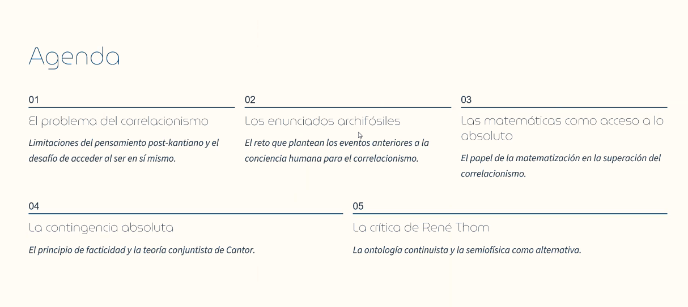

# #biologia #20252Q #filo #soporte   
  
Teoría de la evolución  
  
> La teoría de la evolución explica cómo las especies cambian a lo largo del tiempo mediante procesos naturales como la variación, la herencia y la selección natural.  
  
#Lamarck, Jean-Baptiste 1744 - 1829 #Francia  
#Darwin, Charles 1809 - 1882 #Ingles  
  
**Lamarck:**  
- Propuso la **herencia de caracteres adquiridos** y la “tendencia al perfeccionamiento”.   
- La vida surge constantemente por **generación espontánea** y se organiza en una escala ascendente hacia mayor complejidad.  
  
**Darwin:**  
- Basó su teoría en **variaciones al azar** y **selección natural**: los organismos con rasgos ventajosos dejan más descendencia.  
- Rechaza la finalidad interna de la evolución.  
  

| Aspecto | Lamarck | Darwin |
| ------------------------ | ----------------------------------------------- | ---------------------------------------------- |
| Mecanismo | Uso y desuso; herencia de caracteres adquiridos | Selección natural sobre variaciones heredables |
| Tipo de cambio | Progresivo, interno | Adaptativo, contingente |
| Relación con el ambiente | El ambiente induce cambios | El ambiente selecciona cambios preexistentes |
| Teología | Influencia vitalista y teleológica | Naturalismo no teleológico |
  
  
## Gradualismo  y Saltacionismo  
  
Dos ritmos posibles del cambio evolutivo.  
- **Gradualismo (Darwin):** la evolución ocurre por acumulación lenta y continua de pequeñas variaciones.  
- **Saltacionismo (De Vries, primeros genetistas):** nuevas especies surgen por “saltos” o mutaciones grandes y repentinas.  
  
**Autores clave:**  
- Darwin (gradualismo).  
- Hugo de Vries (saltacionismo).  
- Fisher, Wright, Haldane (síntesis moderna: gradualismo genético).  
  
  
**Problema filosófico:**  
Discute la **continuidad vs. discontinuidad** en la naturaleza y si el cambio evolutivo puede entenderse bajo leyes uniformes o eventos excepcionales.  
  
## Biología evolutiva y tipo de regularidades  
  
- La biología evolutiva estudia los patrones de cambio en los seres vivos.   
- Según Godfrey-Smith, trabaja no con **leyes universales**, sino con **regularidades resilientes** o patrones estables que pueden tener excepciones.  
  
**Problema filosófico:**  
¿Hay leyes en biología? Godfrey-Smith responde que no estrictas, sino regularidades históricas dependientes de contextos (p. ej., la ley de Mendel es válida mientras existan los mecanismos genéticos actuales).  
  
**Ejemplo:**  
El “dogma central” de la biología molecular (ADN → ARN → proteína) es una regularidad, no una ley universal.  
  
## Micro y macro evolución; anagénesis y cladogénesis  
  
- #Microevolución** **cambios en poblaciones dentro de una especie (frecuencias génicas).  
- #Macroevolución** **aparición de nuevas especies o grupos mayores.  
- #Anagénesis** **transformación lineal de una especie en otra.  
- #Cladogénesis** **división de una especie en dos o más (ramificación del “árbol de la vida”).  
  
**Autores:**  
Hennig (filogenia), Godfrey-Smith (cap. 3).  
  
**Relación filosófica:**  
Cuestiona si los mismos mecanismos explican ambos niveles. Godfrey-Smith sugiere continuidad: las mismas fuerzas (mutación-selección) producen ambos, solo cambia la escala.  
  
## Unidad de selección  
¿Sobre qué nivel actúa la selección? Genes, organismos, grupos o especies.  
- **Williams y Dawkins:** el gen es la unidad fundamental (“gen egoísta”).  
- **Hull, Godfrey-Smith:** distinguir entre **replicadores** (lo que se copia) e **interactuadores** (organismos o grupos que interactúan con el entorno).  
##   
## Explicaciones: Origen vs. distribución  
- **Origen:** cómo aparecen las variaciones.  
- **Distribución:** cómo se propagan o desaparecen.  
  
> La selección natural explica distribuciones, pero también influye en la generación de nuevas formas al modificar el contexto sobre el que actúan las mutaciones.  
  
**Problema:**  
Identificar el nivel de causalidad evolutiva y el papel creativo de la selección.  
  
## Sistema inmune y darwinismo universal  
  
El sistema inmunológico opera según un modelo de variación y selección: genera aleatoriamente anticuerpos y selecciona aquellos que reconocen antígenos.  
  
→ Ejemplo de **“darwinismo universal”**: procesos de variación-selección más allá de la biología.  
  
**Autores:**  
Nils Jerne, Burnet; retomado por Godfrey-Smith (cap. 3.4).  
  
**Filosofía:**  
Ilustra la idea de que la selección natural es un patrón general de adaptación, también aplicable a aprendizaje, cultura o ciencia.  
  
## Adaptación, función y construcción  
  
- **Adaptación:** rasgo favorecido por selección natural que aumenta la supervivencia o reproducción.  
- **Función:** efecto que explica por qué una parte o rasgo existe (visión etiológica de Wright).  
- **Construcción:** organismos que modifican su entorno (teoría de la “construcción de nichos”, Lewontin).  
  
**Problema:**  
¿Los organismos son pasivos ante el ambiente o lo construyen activamente?  
Godfrey-Smith combina ambas perspectivas: adaptación + construcción conforman un ciclo recíproco.  
  
## Función de los genes  
  
- Los genes son **unidades de información heredable** que codifican proteínas o regulan su expresión.  
- Para Godfrey-Smith, el “gen” es un concepto funcional e histórico: depende de su papel causal y de cómo participa en ==linajes de transmisión==.  
  
**Problema:**  
Los genes no son moléculas, sino **información transcribible codificada por una molécula de ADN**.  
→ Distinción entre **gen físico** y **gen informacional.**  
  
  
## Taxonomía fenética, filogenética y comunidad reproductiva  
  
- **Fenética:** agrupa especies por similitudes observables (morfología).  
- **Filogenética:** clasifica por ancestros comunes (árbol evolutivo).  
- **Comunidad reproductiva:** define especies por capacidad de cruzarse (Mayr).  
  
**Godfrey-Smith:**  
Estas configuraciones reflejan diferentes **criterios de individuación biológica**: apariencia, historia, o interacción.  
  
## Problema del egoísmo y altruismo  
  
La selección natural parece favorecer el egoísmo, pero existen conductas altruistas.  
  
**Explicaciones:**  
- Selección de parentesco (Hamilton).  
- Altruismo recíproco (Trivers).  
- Selección de grupo (Sober y Wilson).  
  
**Filosofía:**  
Godfrey-Smith analiza cómo la cooperación puede evolucionar en sistemas de competencia, vinculando biología y ética.  
  
## Modelos de cooperación: dilema del prisionero y caza del ciervo  
  
**Dilema del prisionero:** cooperación frágil, racionalidad individual conduce al egoísmo.  
**Caza del ciervo (Stag Hunt):** cooperación estable si hay confianza mutua.  
→ Usados en biología evolutiva para modelar comportamientos cooperativos.  
  
**Godfrey-Smith:**  
Muestra que la cooperación puede ser evolutivamente estable si los organismos interactúan repetidamente.  
  
## Pensamiento tipológico y poblacional  
  
**Tipológico:** la especie es un tipo ideal, variaciones son desviaciones (visión esencialista).  
**Poblacional:** la variación es esencial; las especies son poblaciones dinámicas (Darwinismo).  
  
**Importancia:**  
Marca el cambio de paradigma del pensamiento estático al evolutivo.  
  
## Comunicación e información genética  
  
**Definición:**  
El ADN transmite información, pero no “comunica” intenciones.  
Godfrey-Smith propone reemplazar el lenguaje de “comunicación” por **información**: flujo causal de señales biológicas.  
  
**Problema:**  
Evitar metáforas antropomórficas (mensajes, códigos, etc.) en biología.  
  
## El mensaje genético sin productor/escritor  
  
**Idea:**  
El “mensaje genético” carece de autor, pero puede ser **leído e interpretado** por los sistemas celulares.  
→ La información no es creada con intención, pero tiene significado funcional dentro de la maquinaria biológica.  
  
**Implicación filosófica:**  
La biología moderna muestra un **sentido sin sujeto**, una semiótica natural: hay lectura, pero no autor.  
  
## ==Clase 3 08/18== #correlacionismo #filo  
  
#Meillassoux, Quentin 1967 - #Francia  
#Thom, René Fréderic 1923 - 2002 #Francia  
#Newton, Isaac 1642 - 1727 #Inglaterra  
#   
  
## ==Clase 4 08/25==  
el realismo de #Meillassoux es valido localmente?  
  
## ==Clase 4 09/01==  
  
### Leyes empíricas sobre las poblaciones  
- **Crecimiento exponencial**: si nada lo limita, las poblaciones tienden a crecer rápidamente (mucho más rápido que los recursos disponibles).  
- **Equilibrio de Estado**: en la naturaleza, las poblaciones no crecen indefinidamente, se estabilizan porque hay límites (comida, espacio, depredadores, etc.).  
- **Limitación de recursos**: los recursos son finitos, por lo que no todos los individuos pueden sobrevivir o reproducirse.  
- **Unicidad del individuo**: cada organismo es único, tiene variaciones individuales que lo diferencian de los demás.  
- **(Malthus)**: Thomas Malthus señaló que el crecimiento de la población humana siempre se enfrenta a límites por recursos, lo que inspiró a Darwin.  
- **Heredabilidad de la variación individual**: esas diferencias entre individuos se transmiten a la descendencia.  
- **(Criadores)**: Darwin observó que los criadores de animales podían potenciar ciertas características seleccionando qué individuos reproducir.  
  
**Inferencias**  
- **Lucha por la existencia (Malthus)**: como hay más individuos que recursos, surge competencia por sobrevivir.  
- **Supervivencia diferencial (Spencer, pero atribuida erróneamente)**: algunos individuos, por sus variaciones, tienen más probabilidades de sobrevivir y dejar descendencia que otros.  
- **Evolución por selección (Darwin)**: con el tiempo, las características ventajosas se acumulan en la población → proceso de **selección natural**.  
  
  
### Influencias en la teoría de la población de Malthus  
  
**1. Newton: ley de población entendida como función matemática**  
- Malthus toma inspiración del **modelo newtoniano**, donde los fenómenos naturales se explican mediante **leyes universales expresables en términos matemáticos**.  
- En su caso, la dinámica de la población también puede representarse como una **función matemática**:  
- La población crece en progresión geométrica (2, 4, 8, 16…).  
- Los recursos crecen en progresión aritmética (1, 2, 3, 4…).  
- De ahí deriva la idea de que la población tiende a crecer más rápido que los recursos, generando inevitablemente escasez.  
  
**2. Revolución en la interpretación estadística: de la media a la variación**  
- En el siglo XVIII–XIX cambia la forma de pensar la estadística:  
- Antes se buscaba sobre todo la **media** (lo “normal” o central).  
- Luego empieza a prestarse atención a la **variación**, es decir, a las diferencias, fluctuaciones y distribuciones en una población.  
- Esto influye en Malthus porque su análisis no es estático, sino que enfatiza los **cambios dinámicos en el crecimiento poblacional** y sus consecuencias (hambrunas, epidemias, guerras como correctivos).  
  
  
**3. Teología natural (W. Paley) y el dogma de la predestinación calvinista**  
- Malthus también está en diálogo con la **teología natural**, en especial con William Paley, que veía el mundo como un orden diseñado por Dios (ejemplo famoso: el “relojero”).  
- A esto se suma la influencia del **calvinismo**, con su fuerte acento en la **predestinación** y en una visión bastante dura de la naturaleza humana.  
- Así, la visión de Malthus sobre los “obstáculos inevitables” (miseria, enfermedad, hambre) se conecta con una **antropología pesimista**, donde las limitaciones forman parte del orden natural y divino.  
  
📖 **En síntesis:**  
Malthus combina:  
**Modelo newtoniano** (ley universal, matemáticamente expresable).  
**Nueva estadística** (énfasis en la variación y dinámica poblacional).  
**Teología natural + calvinismo** (visión providencialista y pesimista de la naturaleza humana).  
  
De esa mezcla surge su teoría de que el crecimiento poblacional, al ser más rápido que el de los recursos, inevitablemente genera conflictos y límites naturales.  
  
  
### Influencias en el núcleo del darwinismo contemporáneo:  
**Problema de la flecha del tiempo (Termodinámica vs. Biología):**  
- Termodinámica habla de entropía y desorden creciente.  
- La biología, en cambio, muestra organización creciente (vida, evolución).  
- Se busca compatibilizar ambos enfoques.  
**Weismann – Teoría de la herencia dura:**  
- Diferencia entre **línea germinal** (gametos) y **línea somática** (cuerpo).  
- Niega la herencia de caracteres adquiridos (contra el lamarckismo).  
**Mendel – Aparición de la genética:**  
- Leyes de segregación e independencia de los caracteres.  
- Base de la biología hereditaria moderna.  
**E. Schrödinger – ¿Qué es la vida?**  
- Obra de 1944 que dio fundamentación física a la biología.  
- Introduce la idea del **“cristal aperiódico”**, anticipando el ADN.  
**N. Wiener – Cibernética (Teoría de la Información):**  
- La vida y los organismos vistos como sistemas de comunicación, retroalimentación y control.  
- Aplicación de conceptos de información a la biología.  
**J. Monod – El azar y la necesidad (1970):**  
- Impacto de la biología molecular en filosofía de la biología.  
- Evolución explicada por azar (mutaciones) y necesidad (selección natural).  
- Defiende una visión mecanicista y objetivista de la vida.  
  
### La síntesis estándar de la biología evolutiva (según Elliott Sober) integra distintos enfoques:  
**Sistemática (naturalistas):**  
- Clasificación y ordenamiento de las especies.  
- Permite entender las relaciones evolutivas y la diversidad biológica.  
**Estadística de poblaciones (núcleo de la teoría):**  
- Matemáticas aplicadas a la genética de poblaciones.  
- Explica cómo cambian las frecuencias génicas por mutación, selección, deriva, migración.  
**Unidades de selección (biólogos moleculares):**  
- Debate sobre qué es lo que realmente “evoluciona”: genes, individuos, grupos.  
- Desde Dawkins (gen egoísta) hasta visiones multiescalares.  
**Adaptacionismo (naturalistas y etólogos):**  
- Énfasis en explicar los rasgos como adaptaciones producidas por selección natural.  
- Integración con estudios de comportamiento animal (etología).  
**Eficacia (estadísticos y teoría de juegos):**  
- Medición del éxito reproductivo y supervivencia.  
- Uso de modelos matemáticos y teoría de juegos evolutivos para predecir estrategias.  
  
📖 **Síntesis general:**  
La “síntesis estándar” combina aportes de **naturalistas, genetistas, biólogos moleculares, etólogos y estadísticos** para explicar la evolución. Su núcleo es la **genética de poblaciones**, pero incluye debates sobre **clasificación, unidades de selección, adaptación y eficacia reproductiva**, formando el marco clásico de la teoría evolutiva del siglo XX.  
  
## ==Clase 4 09/08 Genética==  
#Malthus, Thomas Robert 1766 - 1834 #Ingles  
  
## ==Clase 5 09/15 ==  
📌** Godfrey-Smith y el concepto de eficacia**  
**Autor:** Peter Godfrey-Smith (pronunciación en español: *Píter Gód-fri Smíth*)  
**Obra clave:** *Philosophy of Biology* (2003; 2ª ed. 2014).  
  
🌟** Eficacia en biología evolutiva**  
- En el marco de la teoría de la selección natural, Godfrey-Smith analiza cómo ciertos **conceptos funcionales** (función, aptitud, eficacia) deben ser entendidos para dar cuenta de la evolución.  
- **Eficacia** (*fitness efficacy*) se refiere a la **capacidad causal** de un rasgo para producir efectos que favorezcan la supervivencia o reproducción de un organismo.  
- No se trata de eficacia en un sentido teleológico ingenuo, sino de la **eficacia causal real** que un rasgo tiene en contextos concretos.  
  
- Ejemplo:  
- Las alas de un ave son eficaces porque posibilitan vuelo y dispersión, aumentando la probabilidad de reproducción.  
- Esa eficacia es explicada causalmente, no como “finalidad” inherente, sino por su contribución a la persistencia de linajes.  
  
  
🌟** Distinción importante**  
Godfrey-Smith suele diferenciar entre:  
1. Fitness (aptitud biológica): medida estadística de éxito reproductivo esperado en una población.  
2. Eficacia causal: potencia o efectividad concreta de un rasgo o comportamiento en producir ese éxito.  
  
Así, la eficacia se centra en lo causal y mecanístico, mientras que el fitness es un concepto más estadístico y poblacional.  
  
  
📌 Eficacia en filosofía de la biología  
* La noción de eficacia ayuda a resolver debates sobre función biológica:  
* Evita un reduccionismo puramente estadístico (fitness como simple correlación de descendencia).  
* Evita un teleologismo ingenuo (la idea de que los órganos existen “para” algo en un sentido finalista).  
* Permite sostener que los rasgos biológicos funcionan eficazmente porque poseen una capacidad causal que explica su persistencia en la evolución.  
* Este enfoque es clave en discusiones sobre:  
* Explicaciones adaptacionistas (qué cuenta como adaptación real).  
* Niveles de selección (gen, organismo, grupo).  
* Funciones normativas en biología (qué es un corazón “que funciona bien”).  
  
✅ **En síntesis:**  
En Godfrey-Smith, el concepto de **eficacia** refiere a la **capacidad causal de un rasgo** para contribuir a la supervivencia o reproducción. Se diferencia del fitness entendido como medida estadística poblacional. Dentro de la filosofía de la biología, la eficacia permite articular un concepto de función biológica que es causal y explicativo, sin caer en teleología ingenua ni en mero correlacionismo.  
  
**Anagénesis y Cladogénesis**  
🌟** Anagénesis (del griego aná = “hacia arriba” + génesis = “origen”)**  
- Definición: Evolución de una sola línea de descendencia donde una especie cambia gradualmente a lo largo del tiempo hasta transformarse en otra.  
- También se llama filética o transformacional.  
- No aumenta el número de especies, sino que una reemplaza a la otra.  
- Ejemplo: una población de homínidos que cambia gradualmente hasta convertirse en Homo erectus, sin ramas paralelas.  
  
- 🔑 Idea clave: Cambio dentro de una línea evolutiva, continuidad transformada.  
  
🌟** Cladogénesis (del griego klados = “rama” + génesis = “origen”)**  
- **Definición:** Evolución en la que una especie se divide en dos o más líneas de descendencia, produciendo ramificación.  
- También se llama **ramificación** o **divergente**.  
- Aumenta el número de especies, genera biodiversidad.  
- Ejemplo: de un ancestro común, una población de aves se divide en varias especies diferentes adaptadas a distintos nichos (picos de los pinzones de Darwin en Galápagos).  
  
- 🔑 **Idea clave:** División de una línea evolutiva en múltiples ramas.  
  

| Concepto | Anagénesis 🧬 | Cladogénesis 🌿 |
| ------------------ | --------------------------------------------------- | ---------------------------------------- |
| Significado | Transformación en una sola línea | Ramificación en varias líneas |
| Número de especies | No aumenta | Aumenta (se diversifica) |
| Resultado | Una especie se transforma en otra | Una especie da origen a dos o más nuevas |
| Ejemplo | Homo erectus → Homo sapiens (hipótesis anagenética) | Pinzones de Darwin en Galápagos |
| Metáfora | Línea recta en el tiempo | Árbol con ramas |
  
  
**En síntesis:**  
- **Anagénesis** = evolución **lineal** (una especie reemplaza a otra).  
- **Cladogénesis** = evolución **ramificada** (una especie origina varias).  
- Ambos procesos son reconocidos en biología, pero la **cladogénesis** explica mejor la biodiversidad y la estructura arbórea de la evolución.  
  
**Genotipo y Fenotipo**  
🌟** Genotipo**  
- **Definición:** Conjunto de la **información genética** (genes, secuencia de ADN) que posee un organismo.  
- Es el **potencial hereditario**, lo que se transmite de padres a hijos.  
- No siempre se expresa tal cual en el organismo, porque puede depender del ambiente.  
- Ejemplo: el genotipo puede incluir un alelo para ojos azules, aunque el color real de los ojos (fenotipo) dependa de la combinación de genes y su expresión.  
  
- 🔑 **Idea clave:** El **genotipo es el código**.  
🌟** Fenotipo**  
- **Definición:** Conjunto de **rasgos observables** de un organismo, resultantes de la interacción entre el genotipo y el ambiente.  
- Incluye características físicas (color de ojos, altura, forma de las hojas) y también conductuales o fisiológicas.  
- Ejemplo: dos plantas con el mismo genotipo para altura pueden tener fenotipos diferentes si una crece en suelo fértil y otra en suelo pobre.  
  
- 🔑 **Idea clave:** El **fenotipo es la manifestación**.  
📊** Relación Genotipo ↔ Fenotipo**  
El fenotipo no depende solo de los genes, sino también de factores ambientales y epigenéticos.  
Fórmula simplificada:  
  
Fenotipo = Genotipo + Ambiente (+ Interacción Gen–Ambiente)  
## 📌 Cuadro comparativo  

| Concepto | Genotipo 🧬 | Fenotipo 🌱 |
| ------------------ | ---------------------------------------- | ------------------------------------------------ |
| Qué es | Información genética | Rasgos observables |
| Naturaleza | Interna, en el ADN | Externa, visible o medible |
| Herencia | Se transmite de generación en generación | No siempre se hereda (ej. cicatrices) |
| Ejemplo en humanos | Genes que codifican color de piel | Tono de piel real en una persona |
| Ejemplo en plantas | Gen para resistencia a sequía | Planta que efectivamente sobrevive o no a sequía |
  
  
✅ **En síntesis:**  
- **Genotipo** = “lo que está escrito en los genes”.  
- **Fenotipo** = “lo que se ve en la realidad”.  
- El fenotipo resulta de la interacción entre el genotipo y el ambiente, por eso organismos con el mismo genotipo pueden tener fenotipos distintos.  
  
## ==Clase 22/09==  
**Título:** *Mente y materia. ¿Qué es la vida? Sobre la vigencia de Erwin Schrödinger*  
**Autores / Editores:** Hans Ulrich Gumbrecht, Robert Pogue Harrison, Michael R. Hendrickson, Robert B. Laughlin  
**Traductor al español:** Silvia Villegas  
**Editorial:** Katz  
  
**Tema central:**  
Reflexión interdisciplinaria sobre dos obras de Schrödinger — *¿Qué es la vida?* y *Mente y materia* — para analizar su vigencia en la ciencia, filosofía y cultura contemporánea.  
  
🧩** Ideas principales del libro colectivo**  
  
* Aunque no tengo un índice de capítulos exacto de los ensayos del volumen, se desprenden estas ideas principales:  
* **Vigencia del pensamiento de Schrödinger**: Cómo sus preguntas siguen siendo relevantes hoy, no solo en biología, sino también en filosofía de la mente y física.    
* **Problemas entre mente / materia**: Las tensiones entre lo subjetivo (experiencia, percepción, conciencia) y lo objetivo (materia física, estructural). El volumen lo trata desde enfoques humanísticos y científicos.    
* **El rol de la física cuántica en la biología**: Schrödinger sugería que los organismos vivos pueden depender de leyes físicas “no convencionales” o menos exploradas; la idea del “cristal aperiódico” como un portador de información hereditaria.    
* **Entropía, orden y desorden**: Cómo la vida mantiene el orden (“orden del desorden”) ante tendencias físicas hacia el desorden, cómo esto desafía o adapta los principios de la termodinámica.    
* **Implicaciones filosóficas**: Idea del “yo”, conciencia, determinismo vs libre albedrío, el sujeto frente a la ciencia, la universalidad de ciertos conceptos filosóficos orientales (por ejemplo Schrödinger referencia a Vedanta) como comparativo.    
  
📚** Ideas específicas de ¿Qué es la vida? (de Schrödinger)**  
Como sirve de base al libro que pedís, acá van los puntos de Schrödinger:  
  
**Capítulo / Sección**	**Contenido clave**  
- Introduce la pregunta: ¿Cómo puede la vida sostenerse en términos de orden frente al desorden del universo? Presenta la idea de “orden surgido del desorden”.    
- 2‑3	Lo que se sabía en su época sobre herencia, mutaciones. Schrödinger plantea que el portador de la herencia debe ser estable y relativamente pequeño.    
- Introduce la física cuántica como necesaria para explicar la estabilidad de estructuras moleculares vivas.    
- El cristal aperiódico → su idea de que el material hereditario no repite en estructura cristalina simple porque necesita codificar mucha información.    
- Debate sobre si hay leyes físicas desconocidas que rigen la vida, y cómo la vida “mantiene entropía negativa” en sistemas abiertos (información, mantenimiento del orden).    
- Conclusión filosófica: el problema de la conciencia, el yo, libre albedrío, implicaciones religiosas o espirituales: cómo conciliar que somos cuerpos regidos por leyes físicas con que vivimos como sujetos conscientes.    
  
📝** Posibles citas o usos para la facu**  
- “Cristal aperiódico” como metáfora/predicción de lo que sería el ADN; usarla para hablar de predicción científica y de interdisciplinariedad.  
- La reflexión sobre entropía y orden podría servir para relacionar ciencia y filosofía de la biología: qué se entiende por “orden” / “información”.  
- La parte sobre conciencia y “yo” sirve para discusiones de filosofía de la mente: ¿cómo se sitúan las experiencias subjetivas frente a lo físico?  
  
#Epigenesis  
  
## ==Clase 09/29 ==  
  
Eliott Sober  
  
## ==Clase 10/06 ==  
  
#Bateson, Gregory 1904 – 1980  #ReinoUnido  
  
🧩** 1. Pleroma y Creatura**  
Estos términos los toma de **Carl Gustav Jung**, pero Bateson los reelabora con un sentido epistemológico y ecológico.  
**Pleroma**  
- Es el **mundo de la materia sin mente**, el dominio de las causas y efectos físicos.  
- En el *pleroma* los fenómenos son **cuantificables, medibles**, no hay significado ni diferencia: por ejemplo, la gravedad, la temperatura o la masa.  
- Es el ámbito en el que reina la **causalidad eficiente** (la que explica los fenómenos físicos).  
**Creatura**  
- Es el **mundo de los organismos vivos y de la mente**, donde los fenómenos tienen **significado**.  
- Aquí lo importante no es la causa física, sino la **diferencia que hace diferencia** (su definición de información).  
- La *creatura* opera mediante **patrones, relaciones, comunicación, aprendizaje y percepción**.  
  
👉 En resumen:  
El *pleroma* pertenece a la **física**, y la *creatura* a la **biología y la mente**.  
El error epistemológico surge cuando aplicamos categorías del *pleroma* (causalidad material) para entender fenómenos de la *creatura* (procesos mentales o ecológicos).  
  
🗺️** 2. El mapa y el territorio**  
- Este concepto Bateson lo toma de **Alfred Korzybski**, pero lo convierte en una herramienta epistemológica clave.  
- ==“**El mapa no es el territorio**”== significa que **las representaciones mentales, modelos o teorías no son la realidad misma**, sino descripciones parciales y mediadas.  
- En la mente (creatura), lo que operamos no son objetos reales, sino **mapas de relaciones**.  
- Confundir el mapa con el territorio es una **falacia epistemológica** que lleva a errores graves, por ejemplo, creer que nuestros modelos científicos o creencias *son* la realidad.  
  
👉 En su teoría ecológica, el mapa representa el **modelo mental o sistema de información**, mientras que el territorio es el **entorno ecológico real**.  
  
“Toda mente trabaja con mapas del mundo, no con el mundo directamente.”  
  
💡** 3. Información**  
  
Bateson da una definición famosa y muy original:  
  
==“**La información es una diferencia que hace una diferencia.**”==  
  
- No se trata de datos o señales físicas, sino de **patrones significativos que afectan un sistema**.  
- La información solo existe dentro de un **contexto de percepción o respuesta**, es decir, dentro de la *creatura*.  
- Esta idea conecta directamente con su visión ecológica: los sistemas vivos perciben y responden a diferencias (no a causas materiales).  
  
Por ejemplo:  
🌿 Un árbol “responde” a la diferencia entre luz y sombra → eso es información.  
👂 Un ser humano interpreta una palabra o un gesto → también información.  
⚙️ Pero un átomo moviéndose en el espacio no maneja información, solo energía física (*pleroma*).  
  
🔁** 4. Una epistemología ecológica**  
  
De estos conceptos se deriva su tesis central: El conocimiento y la mente no están dentro del individuo, sino **en el conjunto de las relaciones y diferencias que configuran un sistema vivo**.  
  
Bateson llama a esto una **“ecología de la mente”**, donde:  
- El sujeto y el entorno se constituyen mutuamente.  
- Pensar es percibir patrones de diferencia dentro de un sistema de comunicación.  
- Los errores epistemológicos (confundir mapa con territorio, o pleroma con creatura) llevan a destruir esos sistemas — de ahí su preocupación ecológica y ética.  
  
Excelente pregunta — estás entrando en el corazón epistemológico de **Gregory Bateson (Grégori Béitson)**.  
Los conceptos que mencionas —**“hypothesis non fingo”**, **“caja negra”** e **“instinto”**— son ideas que Bateson usa para **definir los límites del conocimiento** y **cómo debe construirse una explicación científica o mental**, especialmente en su *epistemología ecológica*.  
Te explico uno por uno 👇  
  
  
  
🧭** “Hypothesis non fingo”**  
  
📖 *Del latín:* “**no invento hipótesis**.”  
Es una frase de **Isaac Newton** (en los *Principia Mathematica*, 1713) que Bateson retoma **como principio epistemológico**.  
  
🔍** En Bateson:**  
Significa que **no debemos suponer entidades o causas ocultas** cuando podemos **explicar los fenómenos por sus relaciones observables**.  
Es una **postura antirreduccionista y antimetafísica**: el conocimiento debe basarse en la observación de **patrones y diferencias** reales, no en “esencias” o “sustancias internas”.  
En su teoría de la mente, Bateson no dice “la mente está en el cerebro”, sino que la mente es **un sistema de relaciones que codifican diferencias** (entre organismo y entorno, entre percepción y acción).  
  
👉 En resumen:  
  
**“Hypothesis non fingo”** significa: *no postules causas invisibles o interiores; describe los patrones observables de relación.*  
  
Así evita caer en explicaciones lineales o mecanicistas del tipo *A causa B*, que pertenecen al dominio del *pleroma*, no de la *creatura*.  
  
📦** 2. La “Caja negra” (Black box)**  
  
Este es otro concepto fundamental en su epistemología cibernética.  
  
🔍** Significado:**  
Una **“caja negra”** es un sistema del que **no conocemos los procesos internos**, pero **sí podemos observar sus entradas y salidas**.  
La usamos como **modelo epistemológico** cuando nos interesa cómo algo *se comporta*, no qué hay “dentro”.  
  
Por ejemplo:  
Un animal reacciona a un estímulo (entrada) con una conducta (salida).  
No necesitamos conocer todos los mecanismos neuronales internos para describir el patrón de relación funcional.  
  
🧠** En Bateson:**  
La mente, los organismos e incluso los sistemas sociales pueden tratarse como **cajas negras interconectadas**.  
Lo importante no es descubrir la “sustancia mental”, sino **entender el patrón de comunicación entre cajas** (es decir, entre sistemas).  
Este enfoque permite estudiar los procesos mentales, ecológicos y comunicativos **sin reducirlos a lo físico**.  
  
👉 En resumen:  
  
La *caja negra* representa un **modelo relacional y funcional** del conocimiento:  
estudiar **cómo circula la información**, no **qué está dentro** de la entidad.  
  
🐾** 3. El “Instinto”**  
  
Este término Bateson lo critica con fuerza, porque lo considera **un ejemplo de error epistemológico**.  
  
⚠️** Problema:**  
En biología y psicología tradicionales, “instinto” se usaba como **explicación de una conducta automática o innata** (“el ave migra por instinto”).  
Pero Bateson sostiene que eso **no explica nada**: solo **pone un nombre** donde debería haber una descripción del sistema de relaciones.  
  
🔍** En su enfoque:**  
Decir “es instintivo” equivale a introducir una **entidad interior imaginaria** (un homúnculo dentro del organismo).  
En cambio, Bateson propone entender la conducta como resultado de **patrones de comunicación y aprendizaje** dentro del sistema mente-entorno.  
  
👉 En resumen:  
  
“Instinto” es una **mala hipótesis causal**, una *explicación ficticia*.  
En lugar de hablar de instintos, debemos estudiar **cómo se generan y mantienen los patrones adaptativos** en la comunicación del organismo con su ambiente.  
  
🧩** Síntesis comparativa**  
  
**Concepto**	**Sentido en Bateson**	**Función epistemológica**	**Oposición o error que evita**  
**Hypothesis non fingo**	No inventar causas ocultas; describir patrones observables	Evitar teorías metafísicas o reduccionistas	Explicaciones basadas en “esencias” o sustancias  
**Caja negra**	Sistema definido por sus entradas y salidas, no por su interior	Modelo relacional, funcional, comunicativo	Explicación mecanicista o introspectiva  
**Instinto**	“Explicación vacía” de conductas	Crítica al uso de conceptos metafóricos no verificables	Psicología esencialista o biologicista  
  
  
🔄** Conexión entre los tres**  
  
Estos conceptos convergen en su principio epistemológico más profundo:  
  
**“El conocimiento válido no es sobre cosas, sino sobre patrones de relación.”**  
  
Así, Bateson reconfigura la ciencia y la filosofía de la mente en clave **cibernética, ecológica y antirreduccionista**.  
  
🧠** Aprendizaje ≠ Instinto**  
  
🐕** Ejemplo:** El perro que “culebrea” al caer por una pendiente lo hace por instinto, no por aprendizaje.  
  
🔹** Condiciones de lo instintivo:**  
A) No es aprendido.  
B) El organismo desconoce las razones de su acción (actúa “automáticamente”).  
C) Todos los miembros de la especie realizan la conducta en las mismas circunstancias.  
D) Persiste en realizarla aunque el contexto cambie y ya no sea eficaz.  
  
👉 En síntesis: **el instinto es rígido, no adaptativo y carente de comprensión.**  
El aprendizaje, en cambio, implica flexibilidad, experiencia y adaptación.  
  
🦋** Grandes y pequeños instintos**  
**Grandes instintos:** se orientan a la **conservación y supervivencia** de la especie (por ejemplo, reproducción, defensa, alimentación).  
**Pequeños instintos:** son **conductas típicas o características** de la especie, pero más específicas o automáticas.  
  
👉 Bateson critica la apelación indiscriminada a los “instintos” como explicación porque **no aclara el funcionamiento comunicativo ni mental.**  
  
🧩** Conclusiones**  
1. ❌ **No se puede reducir la conducta al mensaje genético**, porque eso contradice la teoría de la comunicación (que implica intercambio e interpretación de información).  
2. ⚠️ **Evitar explicaciones “mágicas” o menudas** (como decir “lo hace por instinto”) que sustituyen el análisis de los procesos reales.  
3. ⚖️ **Es difícil obtener conocimiento objetivo del instinto** sin caer en antropomorfismo (atribuir cualidades humanas).  
4. 🧭 **No multiplicar principios explicativos innecesarios**: mantener la parsimonia científica.  
5. 🌀 **Las metáforas excesivas confunden más que aclaran** cuando se usan como si fueran explicaciones científicas.  
  
🧠** En conjunto:**  
  
Estas notas reflejan el pensamiento **antirreduccionista y epistemológicamente riguroso** de Bateson:  
La conducta no se explica por “instintos” fijos ni por genes, sino por **procesos de comunicación y aprendizaje**.  
El conocimiento válido debe describir **patrones observables de relación**, no apelar a causas invisibles o metafóricas.  
  
  
## ==Clase 10/13 ==  
  
Excelente pregunta 👏  
  
Sí, **tanto Gregory Bateson** (pronunciación aproximada: *Grégori Béitson*) como **Humberto Maturana** (*Umbérto Maturána*) trataron profundamente la **cibernética**, aunque desde perspectivas distintas y en momentos históricos diferentes.  
  
Te explico brevemente qué dice cada uno y cómo se relacionan sus ideas 👇  
  
🧠** Gregory Bateson (1904–1980)**  
- Bateson fue uno de los pensadores centrales de la **segunda cibernética** (o *cibernética de segundo orden*).  
- Participó activamente en las **conferencias Macy** (décadas de 1940–1950), donde se gestó la cibernética junto con Wiener, McCulloch, Mead, entre otros.  
- En su obra **Steps to an Ecology of Mind** (*Pasos hacia una ecología de la mente*, 1972), propone que los **sistemas mentales, sociales y biológicos** pueden entenderse como **circuitos de retroalimentación (feedback)**.  
- Para Bateson, la cibernética no solo explica el control o la comunicación, sino que **describe la manera en que la mente emerge en los sistemas autorregulados**, donde la información circula y se corrige a sí misma.  
- Fue uno de los primeros en ver la **mente como un sistema distribuido**, no localizado únicamente en el cerebro, sino en el conjunto de **interacciones entre organismo y entorno**.  
  
📍En síntesis:  
La **cibernética de Bateson** es una **epistemología del proceso**: una forma de entender cómo los sistemas vivos piensan, se comunican y se adaptan mediante retroalimentación.  
  
🧬** Humberto Maturana (1928–2021)**  
- Maturana, junto con Francisco Varela, **retoma y transforma** la idea cibernética en la década de 1970 con su teoría de la **autopoiesis** (*El árbol del conocimiento*, 1984).  
- La **cibernética de primer orden** (Wiener) se centraba en el **control y la comunicación** en sistemas.  
- Maturana desarrolla una **cibernética de segundo orden**: el observador **forma parte del sistema** que observa.  
- Define los **sistemas vivos** como **sistemas autopoiéticos**, es decir, **capaces de producir y mantener su propia organización** mediante un circuito cerrado de procesos.  
- En su visión, **la vida y el conocimiento son procesos cibernéticos**: sistemas de retroalimentación que se conservan a sí mismos.  
  
📍En sus propias palabras (Maturana & Varela, *Autopoiesis and Cognition*, 1980):  
  
“Todo hacer es un conocer, y todo conocer es un hacer.”  
La organización del sistema vivo se mantiene **en red**, **no jerárquicamente** ni por control externo —una noción profundamente cibernética.  
  
🔁** Relación Bateson – Maturana**  
  
**Aspecto**	**Bateson**	**Maturana**  
Época	1940–1970	1970–2000  
Concepto central	Retroalimentación, ecología de la mente	Autopoiesis, cierre organizacional  
Tipo de cibernética	Segunda cibernética (reflexiva)	Segunda cibernética (observador incluido)  
Enfoque	Comunicación y aprendizaje sistémico	Biología del conocer y autogeneración  
Aporte filosófico	Mente como sistema ecológico	Vida como sistema autopoiético  
  
📚 **En resumen:**  
Tanto Bateson como Maturana conciben la **cibernética** como una forma de entender la **vida, la mente y el conocimiento** en términos de **sistemas autorregulados y circulares**.  
Pero Bateson la usa para **pensar la mente y la comunicación**, mientras Maturana la aplica a **definir la vida y la cognición biológica**.  
  
Excelente pregunta —y muy importante si estás leyendo a autores como **Bateson** o **Maturana**, o incluso a **Godfrey-Smith** cuando habla de sistemas y organización biológica.  
  
🧬** ¿Cómo se relaciona la biología con la cibernética?**  
1️⃣** Qué es la cibernética**  
La **cibernética** (del griego *kybernētikḗ*, “arte de gobernar”) es una **ciencia de los sistemas autorregulados**.  
Fue fundada por **Norbert Wiener** en los años 1940 y se centra en **cómo los sistemas vivos o artificiales se comunican, se controlan y se mantienen en equilibrio** mediante **retroalimentación (feedback)**.  
  
Ejemplo simple:  
- Tu cuerpo **regula la temperatura**.  
- Si sube mucho, transpiras (respuesta correctiva).  
- Si baja, tiritas (respuesta compensatoria).  
👉 Eso es **un circuito cibernético biológico**.  
  
2️⃣** La biología como sistema cibernético**  
- La **biología** estudia los seres vivos, que son **sistemas complejos, autorregulados y adaptativos**.  
- Por eso, muchos biólogos del siglo XX (como **Maturana**, **Varela** o **von Bertalanffy**) vieron que la cibernética ofrecía un **lenguaje común** para describir **cómo los organismos se mantienen vivos**:  
    - Reciben información del entorno (inputs).  
    - Procesan esa información.  
    - Ajustan su comportamiento o estructura (outputs).  
  
💡 En ese sentido, **la vida misma puede entenderse como un proceso cibernético**: un sistema que **se regula, se comunica internamente y mantiene su organización frente al cambio**.  
  
3️⃣** Ejemplos biológicos cibernéticos**  
**Fenómeno biológico**	**Explicación cibernética**  
**Homeostasis** (mantener temperatura, pH, etc.)	Circuitos de feedback negativo que corrigen desviaciones.  
**Metabolismo**	Sistema cerrado que recicla energía e información.  
**Neurofisiología**	Comunicación por señales y autorregulación neuronal.  
**Evolución y adaptación**	Selección natural como retroalimentación entre organismo y entorno.  
  
  
4️⃣** Bateson y Maturana: lo vivo como circuito de información**  
**Bateson** dice que la mente y la vida son **procesos de información y retroalimentación**: la mente es “una danza de diferencias” que se corrige a sí misma, como los ecosistemas.  
**Maturana y Varela** dicen que los seres vivos son **sistemas autopoiéticos**, es decir, **se producen y mantienen a sí mismos** mediante **redes de procesos cerrados** (otra forma de retroalimentación).  
Por eso, para ellos, **vivir y conocer son lo mismo**: el conocer es una forma de mantener la organización vital.  
  
5️⃣** Síntesis**  
🔹 La **cibernética** aporta a la **biología** un modelo para entender **la autorregulación, la comunicación y la organización de los seres vivos**.  
🔹 La **biología**, a su vez, ofrece a la **cibernética** ejemplos reales de **sistemas que se mantienen por sí mismos** (células, organismos, ecosistemas).  
🔹 De esa unión nacen teorías como:  
**Autopoiesis** (Maturana y Varela).  
**Ecología de la mente** (Bateson).  
**Biología de sistemas** (más contemporánea).  
  
En pocas palabras:  
  
🌱 La **biología** estudia cómo viven los organismos.  
⚙️ La **cibernética** explica cómo se **organizan y se mantienen** esos organismos mediante **procesos de control e información**.  
  
Excelente pregunta 👏  
Esta es una de las claves para entender cómo la **biología moderna** —desde la genética hasta la teoría de sistemas— se entrelaza con la **cibernética**.  
  
Te explico paso a paso cómo se vincula el **genoma** con las **teorías cibernéticas**, desde Bateson hasta Maturana y más allá 👇  
  
  
🧬** **1️⃣** El genoma como sistema de información**  
En la **biología molecular**, el **genoma** (el conjunto de genes de un organismo) se entiende como un **sistema que almacena, transmite y procesa información**.  
Esto encaja directamente con los conceptos cibernéticos:  
  
**Concepto cibernético**	**En el genoma**  
**Información**	El ADN codifica instrucciones (secuencias de bases) para producir proteínas.  
**Comunicación**	El ADN “dialoga” con el entorno celular a través de la expresión génica.  
**Control y retroalimentación**	La célula regula qué genes se activan o silencian según señales internas y externas.  
  
👉 Así, el genoma no es solo un “libro de instrucciones”, sino **un sistema de control adaptativo**, que ajusta la actividad celular en función del contexto.  
Eso es precisamente **una idea cibernética**: **feedback** y **autorregulación**.  
  
  
⚙️** **2️⃣** Cibernética y genética: la célula como sistema de control**  
  
Desde la cibernética (Wiener, Ashby, Bateson), la célula puede verse como un **sistema autoorganizado** que:  
1. Recibe información (del entorno o de otras células).  
2. La procesa (a través de señales bioquímicas).  
3. Produce una respuesta (activando o inhibiendo genes).  
  
Este **bucle de información** es un **circuito cibernético molecular**.  
Por eso, los biólogos hablan hoy de **“redes de regulación génica”**: sistemas dinámicos que funcionan exactamente como **redes de retroalimentación**.  
  
🔁** **3️⃣** Bateson: “La información es una diferencia que marca una diferencia”**  
  
Gregory **Bateson** no trabajó directamente con genética, pero su definición de *información* anticipa cómo pensamos el genoma hoy:  
  
“La información es una diferencia que marca una diferencia.”  
  
El ADN funciona así: una **diferencia en la secuencia** (una mutación, por ejemplo) **genera una diferencia funcional** en el organismo.  
Desde el punto de vista cibernético, el genoma es un **sistema de diferencias codificadas** que **responde y se ajusta** dentro de una red de control celular.  
  
🧩** **4️⃣** Maturana y Varela: la biología del conocer y la autopoiesis**  
  
Para **Humberto Maturana** y **Francisco Varela**, el **genoma no “controla” al organismo**, sino que **forma parte del sistema autopoiético** que **se mantiene a sí mismo**.  
* En su teoría, **la información genética solo tiene sentido dentro de la red de procesos metabólicos**.  
* No hay un “programa” central que dirija todo (como creía la biología mecanicista).  
* En cambio, el genoma **coopera** con los demás componentes celulares en un **circuito cerrado de producción** (autopoiesis).  
  
👉 Desde la cibernética de segundo orden (la del observador incluido), el genoma **no es un mando**, sino **un nodo más dentro del sistema autorreferente que es la vida**.  
  
  
🧠** **5️⃣** En la biología contemporánea**  
Hoy, con la biología de sistemas y la genómica computacional, estas ideas convergen:  
* Se estudia el **genoma como una red compleja**.  
* Se analizan los **circuitos de retroalimentación génica** (por ejemplo, genes que activan o inhiben a otros).  
* Se usan **modelos cibernéticos** para simular el comportamiento del sistema completo (homeostasis, respuesta inmune, diferenciación celular, etc.).  
  
  
🧭** En síntesis**  

| Nivel | Visión cibernética | Relación con el genoma |
| ----------------- | ------------------------------------------------------------ | ----------------------------------------------------------------- |
| Bateson | Información y feedback como base de lo mental y lo biológico | El ADN codifica información: “diferencias que marcan diferencias” |
| Maturana & Varela | Autopoiesis: los seres vivos se autoorganizan | El genoma es parte del circuito autopoiético, no su “programador” |
| Biología moderna | Sistemas de control e información interconectados | Redes génicas autorreguladas: feedback molecular y sistémico |
  
  
💡 **Conclusión:**  
El **genoma** es la **expresión molecular** de los principios cibernéticos de **información, control y retroalimentación**.  
No gobierna la vida desde fuera, sino que **participa activamente en el sistema vivo que se autorregula y se mantiene**.  
  
Excelente pregunta 👏 —y muy profunda.  
Va al corazón de lo que distingue la **vida biológica** de los **sistemas artificiales o digitales**, y de cómo **Maturana y Varela** definieron la **autopoiesis** (*αὐτός = sí mismo* + *ποίησις = producción*).  
  
Vamos paso a paso 👇  
  
  
  
🧬** **1️⃣** Qué es la autopoiesis**  
  
Según **Humberto Maturana** (*1928–2021*, Chile) y **Francisco Varela** (*1946–2001*, Chile),  
  
un **sistema autopoiético** es aquel que **se produce y mantiene a sí mismo**, generando continuamente sus propios componentes y los límites que lo definen.  
  
En su formulación original (*Autopoiesis and Cognition: The Realization of the Living*, 1980):  
  
“Un sistema vivo es una red de procesos de producción (de componentes) que, mediante sus interacciones, **generan la red que los produce**, constituyendo así una unidad concreta en el espacio físico.”  
  
💡 En otras palabras: la autopoiesis **no solo regula** un sistema (como en la cibernética clásica), sino que **lo constituye**.  
La célula es el ejemplo paradigmático:  
Produce sus propias partes (membrana, proteínas, enzimas).  
Mantiene su límite (membrana plasmática).  
Repara y reorganiza su estructura para seguir siendo la misma unidad.  
  
  
  
⚙️** **2️⃣** ¿Solo los sistemas vivos pueden ser autopoiéticos?**  
  
👉 Según **Maturana y Varela**, **sí**.  
Ellos fueron muy explícitos en que **solo los sistemas biológicos** pueden considerarse **autopoiéticos “en sentido estricto”**.  
  
¿Por qué?  
Porque la autopoiesis requiere una **realización material concreta**: procesos químicos que producen los componentes del propio sistema.  
Un sistema digital, aunque pueda **simular** autorregulación o reproducción de información, **no se produce físicamente a sí mismo**; depende de hardware, energía y soporte externo.  
  
📍 Maturana lo dice claramente:  
  
“Un sistema computacional no es autopoiético; puede representar o imitar la organización, pero **no la realiza**.”  
(*El árbol del conocimiento*, cap. 2)  
  
  
  
💻** **3️⃣** ¿Y los sistemas digitales? ¿Pueden ser “autopoiéticos” en otro sentido?**  
  
Algunos teóricos posteriores (como Niklas Luhmann o Heinz von Foerster) **ampliaron el concepto** de autopoiesis más allá de lo biológico:  
**Luhmann** aplicó la autopoiesis a los **sistemas sociales** (por ejemplo, la comunicación se reproduce a sí misma dentro del sistema social).  
En inteligencia artificial y sistemas digitales, se habla de **“autopoiesis simbólica”** o **“informacional”**: programas que **redefinen su propio código o estructura** en respuesta al entorno (como redes neuronales autoajustables).  
  
🔹 Sin embargo, eso es una **metáfora ampliada**, no autopoiesis en el sentido **biológico original**.  
Los sistemas digitales **no se generan físicamente a sí mismos**, solo **procesan información** sobre sí mismos.  
  
  
  
🧭** **4️⃣** En síntesis**  
  

| Aspecto | Sistemas vivos (biológicos) | Sistemas digitales / artificiales |
| -------------------- | ---------------------------------------------- | ------------------------------------------------------ |
| Naturaleza | Material (química, metabólica) | Simbólica (informacional, programada) |
| Autoproducción | Sí: producen sus propios componentes y límites | No: dependen de soporte físico y energía externa |
| Tipo de organización | Autopoiética (en sentido estricto) | Autoorganizada o autoreferente (en sentido metafórico) |
| Ejemplo | Célula, organismo, ecosistema | Red neuronal, programa adaptativo, IA |
  
  
💡** Conclusión**  
  
🔸 **La autopoiesis es una propiedad esencial de los sistemas vivos**, no de los digitales.  
🔸 Los sistemas digitales pueden **simular** procesos autopoiéticos, pero no **realizarlos**.  
🔸 Dicho de otro modo: **la vida se produce a sí misma; la máquina, no**.  
  
Perfecto 👍 Te preparo unas **==notas en limpio==** (ordenadas y resumidas) basadas en todos los slides que subiste.  
Son apuntes de filosofía de la biología sobre **Gregory Bateson** y **Humberto Maturana**, con las ideas principales de cada autor y sus diferencias conceptuales.  
  
🧭** Diferencias Fundamentales: Espíritu vs. Autopoiesis Molecular**  
**Gregory Bateson (Cibernética de la pauta)**  
- El “Espíritu” o “Mente” es un sistema de relaciones y pautas entre componentes interactuantes.  
- El pensamiento se extiende a la evolución, el aprendizaje, la ecología y la vida.  
- Enfatiza la **información externa**, la diferencia y la comunicación  
- La evolución implica **novedad y azar** (mutación + selección natural).  
**Humberto Maturana (Autopoiesis biológica)**  
- El ser vivo se define como un **sistema autopoiético molecular**, capaz de autogenerarse y mantener su organización.  
- La vida es un fenómeno **sistémico y cerrado**, no meramente molecular.  
- Rechaza la noción de información externa como determinante.  
- Propone el **determinismo estructural**: los cambios dependen de la estructura interna del organismo.  
- La evolución ocurre por **deriva estructural**, no por selección externa.  
  
⚙️** Relación con las Máquinas y Límites del Sistema**  
**Bateson**: Las máquinas también pueden procesar información. Los principios cibernéticos (retroalimentación, diferencia) son válidos tanto para lo vivo como para lo artificial. → El sistema espiritual puede incluir subsistemas ecológicos o tecnológicos.  
**Maturana**: Distingue a los seres vivos de las máquinas artificiales porque estas **no son autopoiéticas**. → Los seres vivos poseen un dominio de existencia propio y clausura estructural.  
  
  
💬** Papel de la Información**  
-**Bateson**:  
-La información proviene de diferencias externas (“la diferencia que marca una diferencia”).  
-Las fuentes externas generan información nueva (por ejemplo, visión binocular o interacción entre especies).  
-**Maturana**:  
-El medio no determina cambios; solo los gatilla.  
-Los cambios son internos al sistema y dependen de su organización.  
-La información externa **no existe** como entidad causal en la autopoiesis.  
  
  
  
🧬** Topobiología y Mecanismos Biológicos**  
-**Topobiología (Gerald M. Edelman)**:  
Campo que estudia las interacciones moleculares durante el desarrollo embrionario.  
-**Moléculas Morfodreguladoras**:  
Median interacciones entre células y coordinan la organización desde el gen hasta el tejido.  
→ Esenciales para la comunicación celular y señales inductivas.  
-**Mecanismos Epigenéticos**:  
Explican cómo señales químicas alteran la función de las moléculas morfogenéticas.  
-Procesos primarios: división, movimiento, adhesión y muerte celular.  
-Fuerzas impulsoras: regulan la forma y el patrón del desarrollo.  
  
  
  
🧩** Rechazo a la Realidad Objetiva**  
Ambos sistemas niegan que la verdad sea un reflejo directo de una realidad exterior.  
  
**Bateson**: Toda experiencia es subjetiva.  
La información es un patrón o redundancia, no una sustancia.  
El conocimiento es una pauta, no una copia de lo real.  
  
**Maturana**: La realidad está estructuralmente determinada por el observador.  
El observador no accede a una “realidad objetiva”, sino que genera explicaciones desde su propia coherencia estructural.  
Lo que sucede depende de la dinámica del ser vivo.  
  
🔄** Naturaleza del Cambio**  
**Bateson**:  
La evolución es un proceso **estocástico (aleatorio)** que introduce novedad.  
El cambio resulta de la combinación entre azar (mutación) y selección natural.  
**Maturana**:  
Rechaza la selección natural como “mecanismo generativo”.  
La evolución ocurre mediante **deriva estructural**, donde el entorno solo modula, no dirige.  
  
🧾** Resumen Conclusivo**  
**Bateson** propone una **cibernética universal**, donde la mente y la vida son sistemas de información y relación (pauta).  
**Maturana** formula una **cibernética de la vida**, donde el ser vivo se define por su **autopoiesis y clausura operacional**.  
  
👉 Para Bateson, el **Espíritu** es una propiedad relacional que se extiende por la Naturaleza.  
👉 Para Maturana, la **realidad** está constituida por la dinámica estructural que el ser vivo conserva en su linaje.  
  
  
## ==Clase 10/20==  
  
Claro 👍 Acá tenés la información de la diapositiva pasada **en limpio y ordenada** para tus apuntes:  
  
🐒** ¿Qué es la Etología?**  
  
La **etología** es la ciencia que estudia el **comportamiento animal** (y humano) desde una perspectiva **biológica y evolutiva**, observando cómo las conductas contribuyen a la adaptación y supervivencia.  
  
🔹** Las 4 categorías del comportamiento según Niko Tinbergen:**  
1. **Desarrollo** → cómo se forma la conducta a lo largo de la vida.  
2. **Causas** → qué mecanismos la provocan (fisiológicos, neurológicos, hormonales).  
3. **Funciones** → para qué sirve o cuál es su valor adaptativo.  
4. **Evolución** → cómo ha cambiado la conducta a lo largo del tiempo en la especie.  
  
🔹** Relación entre Psicología y Etología**  
- Ambas estudian el comportamiento, pero desde **modelos teóricos distintos**.  
- La **psicología** tiende a centrarse en los procesos mentales y el aprendizaje.  
- La **etología** se enfoca en el **comportamiento observable** y su base biológica.  
- En el modelo etológico de **Konrad Lorenz** predomina el **innatismo** (las conductas instintivas heredadas).  
  
🔹** Principales conceptos etológicos**  
1. **Pautas fijas de comportamiento (FAP)**  
- Son **secuencias de conducta innatas**, automáticas y repetitivas ante un estímulo  
- Se registran en el **etograma**, que es el catálogo de comportamientos de una especie.  
  
1. **Sistema sensorial**: Involucra **estímulos desencadenadores** y **señales** que provocan la conducta.  
Conceptos clave:  
- **Umwelt** → el “mundo perceptivo” propio de cada especie.  
- **Impronta (imprinting)** → aprendizaje rápido e irreversible en las primeras etapas de vida (Lorenz)  
2. **Motivación (Drive)**  
- Modelo inicial **psicohidráulico**: la energía de una conducta se “acumula” y se descarga al presentarse el estímulo adecuado.  
- Evoluciona hacia un modelo **informacional**, que considera tanto factores internos como externos.  
Conceptos asociados:  
**Acumulación de energía**  
**Actividad en vacío** (conducta sin estímulo externo)  
**Agotamiento o saciación**  
**Factores internos y externos** que modulan la conducta.  
  
  
**¿Qué es la Etología? (Continuación)**  
  
**Desarrollo: Instinto y Aprendizaje**  
La conducta animal resulta de la interacción entre lo **innato** (instintivo) y lo **adquirido** (aprendido).  
La **etología** estudia cómo los comportamientos instintivos se modifican mediante el **aprendizaje**.  
Relación con el **conductismo**:  
	El **conductismo** se centra en el aprendizaje por refuerzo (experimentos de laboratorio)  
	La **etología** observa el comportamiento en el **ambiente natural** y considera la herencia biológica.  
En resumen: la etología busca integrar **biología + psicología** del comportamiento.  
  
**Evolución: Filogenia y Ontogenia del Comportamiento**  
**Filogenia** → historia evolutiva del comportamiento en una especie (cómo surgió y se diversificó).  
**Ontogenia** → desarrollo del comportamiento a lo largo de la vida de un individuo.  
Ambas perspectivas ayudan a entender **cómo y por qué** una conducta existe.  
Ejemplo: los comportamientos de apareamiento o defensa tienen raíces evolutivas (filogenéticas) y se desarrollan con la experiencia (ontogenéticas).  
  
**Comunicación Animal**  
**Cripticidad:** algunas señales son difíciles de detectar por depredadores (camuflaje o señales discretas).  
**Comunicación dentro del grupo:** coordinación social, jerarquía, cooperación.  
**Comunicación con depredadores:** señales de advertencia o engaño.  
**Recepción y significado:** se estudia cómo los animales interpretan las señales (el “mensaje”).  
**Formas de la señal:**  
- **Óptica** (visual)  
- **Sonora** (auditiva)  
- **Olfativa** (química)  
**Comunicación como lenguaje:** en algunos animales hay estructuras de comunicación complejas (ej. abejas, primates, cetáceos).  
  
**Organización Social**  
Aspectos sociales del comportamiento animal:  
**Defensa** colectiva o individual.  
**Parentesco** y cooperación (ayuda entre individuos emparentados).  
**Dominancia territorial** (jerarquías y defensa del territorio).  
**Sincronía de comportamiento** (movimiento coordinado del grupo).  
**Transmisión cultural:** aprendizaje social y herencia de conductas (ej. uso de herramientas, cantos, rutas migratorias).  
  
##   
🧠** Konrad Lorenz (pron. Kón-rad Ló-rents)**  
##   
**Sobre la agresión: el pretendido mal (1963)**  
  
## En esta obra, Lorenz compara la etología con la psicología del comportamiento (conductismo) para mostrar cómo cada una entiende el origen y las causas de la conducta —especialmente la agresión.  
  
##   
📊** Comparación entre Etología y Psicología del Comportamiento**  
  
**Etología**	**Psicología del comportamiento (Conductismo)**  
**Instinto (innato)**: La conducta tiene una base biológica heredada. El comportamiento surge de impulsos naturales (instintos).	**Pizarra en blanco (tabula rasa)**: El individuo nace sin conductas predeterminadas; todo se aprende por experiencia.  
**Investigación de campo**: Observa al animal en su entorno natural, donde el comportamiento tiene sentido adaptativo.	**Laboratorio**: Estudia la conducta en condiciones controladas, con estímulos artificiales.  
**Pulsiones / impulsos**: Las conductas responden a impulsos internos (modelo psicohidráulico de Lorenz: la energía se acumula hasta descargarse).  
**Estímulo / respuesta**: La conducta es una reacción aprendida ante un estímulo externo.  
**Naturaleza**: Considera el comportamiento como producto de la evolución y la biología del animal.	**Experimento**: Prioriza la manipulación experimental para establecer leyes generales del aprendizaje.  
  
  
** Ideas clave de Lorenz sobre la agresión:**  
- La **agresión** no es necesariamente negativa: cumple una **función biológica** en la regulación del territorio, jerarquías y defensa.  
- En el ser humano, el problema surge cuando los **mecanismos inhibitorios naturales** (propios del entorno natural) se desajustan por la **vida moderna y la cultura**.  
- Propone entender la agresión como una **energía instintiva** que debe canalizarse socialmente (no eliminarse).  
  
📚** Importancia:**  
  
Lorenz introduce una visión **biológica y evolutiva del comportamiento, frente al enfoque puramente ambientalista y experimental del conductismo.**  
## Su trabajo fue fundamental para establecer la etología como ciencia autónoma y le valió el Premio Nobel de Medicina en 1973, junto con Tinbergen y von Frisch.  
  
  
🐾** Formas de socialización en el reino animal**  
  
La **socialización animal** puede adoptar distintos niveles de complejidad, desde agrupamientos anónimos hasta vínculos personales y afectivos.  
Estas categorías se inspiran en los estudios de **Konrad Lorenz** sobre la conducta social y la agresión.  
  
**Agregado**  
- Son **multitudes anónimas**, sin reconocimiento entre sus miembros.  
- No hay relaciones sociales estables ni cooperación.  
- Ejemplo: **cardumen de sardinas**, **bandadas de estorninos** (aves).  
- Se forman por ventajas adaptativas inmediatas (protección, movimiento coordinado).  
**Colonias**  
- Comunidades basadas en una **estructura local o territorial común**.  
- Existe cierto **reconocimiento recíproco** entre grupos o familias vecinas.  
- A veces se establecen **pactos de no agresión**.  
- Ejemplo: **garzas** u otras aves coloniales que anidan en la misma zona.  
**Clanes**  
- Comunidad unida por **señales químicas (olfativas)** o por **reconocimiento interno**.  
- Los individuos se comportan “adecuadamente” dentro del clan, pero son **muy agresivos** con miembros de otros grupos.  
- Ejemplo: **clanes de ratas** o de mamíferos sociales (algunos carnívoros).  
- Hay **cooperación interna** y **agresión defensiva externa**.  
  
**Vínculo**  
- Forma más compleja de socialización.  
- La **cohesión del grupo** se basa en el **reconocimiento personal** (cada individuo distingue a los demás).  
- La **pulsión de agresión** tiene aquí una función reguladora del vínculo:  
- Lorenz sostiene que **la agresión controlada y ritualizada fortalece los lazos sociales**.  
- Su famosa frase resume esta idea:  
*Sin agresión no hay amor.”*  
Es decir, la energía agresiva puede canalizarse en conductas sociales positivas, evitando la destrucción y promoviendo el equilibrio dentro del grupo.  
  
  
🧩** El vínculo – Capítulo XI (Konrad Lorenz)**  
En este capítulo, Lorenz analiza la **agresión y el vínculo social** en los animales, mostrando cómo la agresión no solo destruye, sino que también **organiza y preserva** la vida social y la especie.  
  
**Agresión extraespecífica e interespecífica**  
**Extraespecífica:** entre individuos de **especies diferentes** (por ejemplo, depredador y presa).  
**Interespecífica:** entre individuos de la **misma especie**, generalmente por territorio, pareja o jerarquía.  
👉 Ambas cumplen una **función adaptativa**, no son simples actos de violencia.  
  
**Selección del más fuerte**  
La agresión sirve como **mecanismo natural de selección**: los más fuertes o mejor adaptados aseguran su reproducción y la **perpetuación de la especie**.  
Sin embargo, esta selección **no implica exterminio**, sino equilibrio dentro del grupo.  
  
**Distribución del espacio vital**  
La competencia agresiva permite una **distribución uniforme del territorio o espacio vital**.  
Los **más fuertes** obtienen los mejores espacios, pero los **más débiles** también logran sobrevivir dentro del orden establecido.  
👉 La agresión regula la convivencia y evita el hacinamiento.  
  
**Orden jerárquico**  
De estos enfrentamientos resulta la **formación de jerarquías estables** (“orden de picoteo” en aves, por ejemplo).  
Este orden disminuye los conflictos porque cada individuo **conoce su lugar** en la estructura social.  
  
**Función conservadora de la selección**  
La **selección natural**, según Lorenz, **no elimina** indiscriminadamente a los menos aptos, sino que **mantiene la estabilidad** del grupo.  
En la naturaleza, las **“batallas a muerte” son raras**: los animales suelen ritualizar la agresión para **evitar la destrucción mutua**.  
👉 La agresión tiene, por tanto, una **función de equilibrio y conservación**, no de aniquilación.  
  
🧠** Idea central del capítulo:**  
La agresión, lejos de ser “el mal”, es un **instinto necesario para la organización social y la continuidad de la especie**.  
En equilibrio con otros impulsos (como el apego o la cooperación), contribuye al **vínculo y a la estabilidad del grupo**.  
  
  
🐾** Ejemplos del reino animal (Konrad Lorenz)**  
  
Estos ejemplos muestran cómo la **agresión, el instinto y la socialización** se manifiestan en distintas especies y sirven para **mantener el equilibrio y la cohesión** dentro de los grupos animales.  
  
  
**Reorientación de la agresión — Los cíclidos (peces)**  
Cuando no pueden descargar su agresión hacia el objetivo original (por ejemplo, un rival ausente), los cíclidos la **reorientan** hacia otro objeto o individuo disponible.  
Este fenómeno muestra cómo la agresión **busca una vía de descarga**, confirmando la teoría de Lorenz del **modelo psicohidráulico** (energía acumulada que debe liberarse).  
  
**Conductas ritualizadas — Los anátidos (patos y aves acuáticas)**  
La agresión y el cortejo se expresan mediante **rituales fijos** (movimientos, posturas o vocalizaciones simbólicas)  
Estas conductas **reducen la violencia real**, ya que permiten comunicar dominancia o sumisión **sin dañar al otro**.  
👉 Ejemplo clásico de **ritualización de la agresión**: el enfrentamiento entre patos machos por territorio.  
  
**Fenómeno de la impronta (imprinting)**  
Descubierto por Lorenz en patos y gansos.  
Es un proceso de **aprendizaje temprano e irreversible**, donde el animal joven reconoce como figura materna al primer objeto en movimiento que ve.  
La impronta **asegura la supervivencia** (seguimiento y protección) y también influye en la formación de vínculos sociales y sexuales.  
  
  
**Grito del triunfo y salutación**  
Conductas vocales y gestuales que **fortalecen el vínculo social** después de un conflicto o una caza exitosa.  
Funcionan como **descarga emocional** y **reafirmación jerárquica o afectiva** dentro del grupo.  
Ejemplo: aullidos de lobos tras cazar, o cantos de aves luego de defender su territorio.  
  
**Inhibición de matar en la naturaleza**  
En la mayoría de las especies, existen **mecanismos inhibitorios** que impiden matar a miembros de la misma especie.  
Ejemplo: **lobos, ciervos o aves** detienen la pelea cuando uno se somete.  
Esto evita la destrucción interna y **mantiene la estabilidad del grupo**.  
Contrasta con el ser humano, que puede superar esas inhibiciones a través de la cultura y las armas.  
  
  
**La idea del acumulador**  
Lorenz propone que los impulsos instintivos funcionan como un **acumulador de energía**:  
Si no se liberan por una vía adecuada (por ejemplo, conducta ritual), **la presión aumenta** hasta descargarse espontáneamente.  
Este modelo explica tanto la **agresión** como otros comportamientos instintivos (cortejo, juego, defensa).  
  
**Conclusión general:**  
En el reino animal, la agresión no es destructiva en sí misma: cumple una **función reguladora, comunicativa y adaptativa**.  
La cultura humana, al distorsionar esos mecanismos naturales de inhibición y descarga, puede transformar la agresión en violencia.  
  
